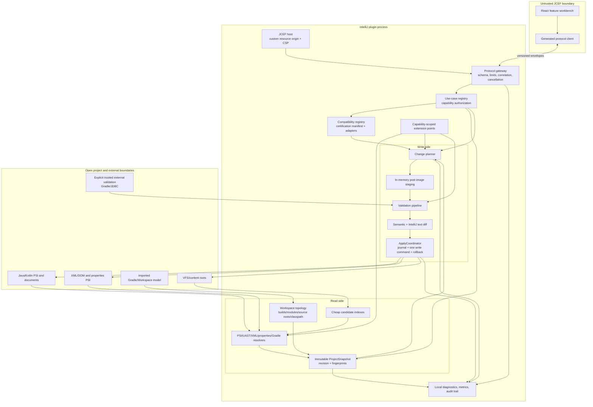
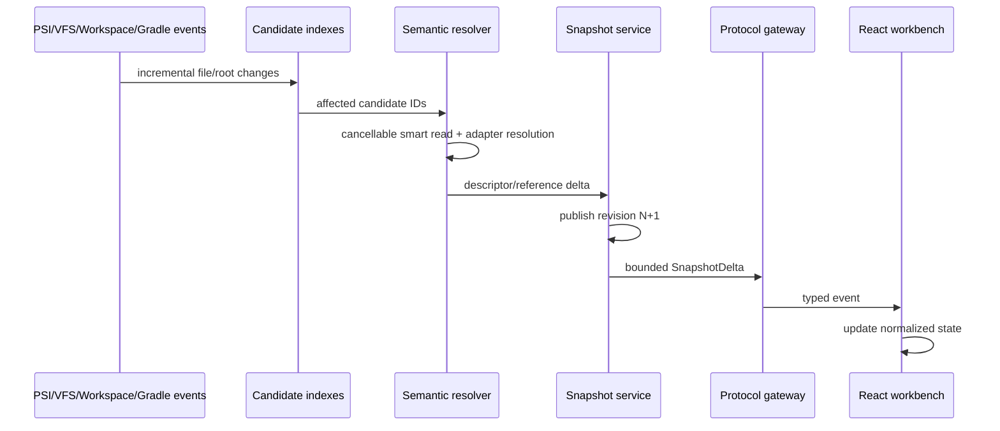
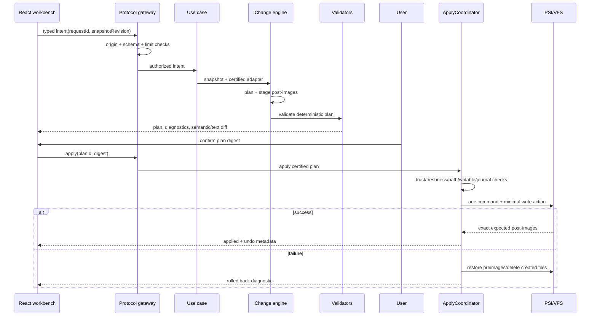

# Architecture Patterns

**Project:** Jmix Visual Development Workbench  
**Domain:** Enterprise IntelliJ plugin for semantic, visual, round-trip development of existing Jmix applications  
**Researched:** 2026-07-27  
**Overall confidence:** HIGH for IntelliJ Platform boundaries and safety pipeline; MEDIUM for exact Jmix/Gradle compatibility details until fixture certification is implemented

## Executive Recommendation

Build a **modular monolith inside the IntelliJ process**. React/JCEF should remain a visual projection and intent-capture surface, while Kotlin services own project discovery, semantic analysis, compatibility decisions, validation, and all writes. Do not turn JCEF into a local web server, do not create a second source-of-truth database, and do not let feature generators write files directly.

The target architecture has four central ideas:

1. **An immutable semantic project snapshot** assembled incrementally from IntelliJ Workspace Model, existing indexes, targeted Jmix indexes, PSI/UAST, XML DOM/PSI, properties PSI, and the IDE's imported Gradle model.
2. **Feature-level compatibility certification**. A project is never merely “supported.” Each read or write capability is evaluated against a bundled certification manifest containing Jmix version, IDE build, JDK, language, build DSL, repository topology, installed add-ons, data-store shape, and artifact customizations. Recognized but uncertified projects remain useful in read-only diagnostic mode.
3. **A single change pipeline**: intent → deterministic plan → staged post-images → semantic/text diff → validation → explicit confirmation → freshness and trust recheck → one undoable write command → targeted re-index → audit. No other component may mutate a project.
4. **Jmix-version adapters** around a stable internal model. Jmix 2.8 LTS and Jmix 3.x differ materially, and legacy Jmix repositories must be recognized without being modified by guessed rules. Version differences, add-on catalogs, XML dialects, code recipes, and validation rules belong in adapters, never scattered conditionals.

This replaces the prototype's unsafe path:

```text
React payload -> Gson data class -> string generator -> File.writeText()
```

with:

```text
Untrusted UI intent
    -> schema-validated protocol gateway
    -> certified use case
    -> immutable semantic snapshot
    -> Jmix adapter + artifact-specific semantic edits
    -> staged and validated ChangePlan
    -> preview/confirmation
    -> conflict-checked atomic apply
```

JetBrains explicitly describes UAST as read-only, requires PSI/document changes to be performed inside commands and write actions, and recommends doing expensive PSI/index work off the EDT. Those constraints should shape the architecture rather than be hidden inside utility functions. Sources: [UAST](https://plugins.jetbrains.com/docs/intellij/uast.html), [Modifying PSI](https://plugins.jetbrains.com/docs/intellij/modifying-psi.html), [Documents](https://plugins.jetbrains.com/docs/intellij/documents.html), [Threading Model](https://plugins.jetbrains.com/docs/intellij/threading-model.html).

## Non-Negotiable Invariants

1. **Source is authoritative.** The workbench stores projections, fingerprints, and user drafts, not an independent canonical application model.
2. **No mutation without certification.** Recognition enables diagnostics; only a matching feature-level certification enables Apply.
3. **No mutation from JCEF, generators, validators, adapters, or extensions.** Only `ApplyCoordinator` owns the write capability.
4. **Every mutation has a plan.** The exact affected roots, preconditions, structured operations, post-images, diagnostics, and diff exist before confirmation.
5. **Preview and apply use the same plan digest.** Any source, root-model, adapter, or compatibility change invalidates the plan.
6. **Existing structured files are changed semantically.** Whole-file replacement is allowed only for a newly created, workbench-owned file or an explicit full-replacement operation the user can see.
7. **Unknown syntax is preserved.** If preservation cannot be proven, that artifact is read-only.
8. **An apply failure is rolled back before the command completes.** A process crash is handled by a recovery journal on next open; the architecture does not claim filesystem-level ACID transactions.
9. **All project-wide reads are cancellable and smart-mode-aware.** No recursive VFS walk, reference resolution, or index query runs on the EDT.
10. **Protocol payloads are untrusted.** Allowlisting, schema validation, size/depth limits, origin checks, timeouts, and cancellation are enforced in Kotlin.
11. **Compatibility evidence is reproducible.** A “certified” matrix row links to fixture commits and passing CI evidence.
12. **No source or secrets leave the machine by default.** Diagnostics and telemetry are local and redacted unless the user explicitly exports or opts in.

## Recommended Architecture



### Architectural Style

Use a **ports-and-adapters modular monolith**, packaged as one IntelliJ plugin distribution unless IDE binary compatibility requires separate artifacts. This provides strong internal boundaries without creating network processes, deployment complexity, or source synchronization problems.

The stable center contains:

- Repository-independent semantic descriptors.
- Use-case contracts.
- Compatibility/capability contracts.
- Change operations and validation diagnostics.
- Protocol envelopes.

IntelliJ PSI, Jmix versions, JCEF, Gradle integration, and optional JDBC are adapters around that center.

## Component Boundaries

| Component | Responsibility | May Depend On | Must Not Do |
|---|---|---|---|
| React Workbench | Render semantic DTOs, maintain unsaved UI drafts, capture user intent, display diagnostics/diffs | Generated protocol client, feature-local state | Read local files, infer compatibility, generate source as truth, or write anything |
| JCEF Host | Load bundled assets from a controlled origin, apply CSP/navigation policy, own browser lifecycle | IntelliJ JCEF and disposables | Dispatch domain actions or expose arbitrary Kotlin methods |
| Protocol Gateway | Validate envelopes and payload schemas, authorize action names, correlate requests, enforce limits, timeouts, and cancellation | Contract schema, use-case registry | Deserialize directly into PSI objects or invoke file writes |
| Use-Case Registry | Map a typed intent to a query or plan request and enforce capability status | Snapshot service, compatibility registry, planners | Contain Jmix-version `if/else` logic or mutate files |
| Workspace Topology Service | Represent builds, included builds, modules, source/resource roots, classpaths, languages, and data-store locations | Workspace Model, imported Gradle model, ProjectFileIndex | Guess roots from `src/main/java` or regex alone; run Gradle silently |
| Candidate Indexes | Locate likely Jmix artifacts cheaply from file-local input | File-based index APIs, file types | Resolve cross-file symbols, access another index while indexing, or hold PSI |
| Semantic Resolver | Turn candidates into normalized descriptors and cross-artifact references | PSI/UAST, XML DOM/PSI, properties PSI, topology, adapter catalog | Store long-lived mutable PSI trees or modify PSI |
| Project Snapshot Service | Publish immutable, revisioned semantic snapshots and deltas | Topology, indexes, resolver, modification trackers | Become a shadow database or serialize entire source trees |
| Compatibility Registry | Detect Jmix line and repository shape; return feature-level read/write capability with evidence | Certification manifest, version adapters, resolved dependencies | Treat “Jmix 2.x” or “Jmix 3.x” as blanket write support |
| Jmix Version Adapter | Interpret/render version-specific annotations, XML, recipes, add-ons, and validation rules | Stable semantic model, public Jmix metadata | Write files or bypass certification |
| Artifact Adapters | Read, simulate, and apply language-specific semantic operations | Java/Kotlin/XML/properties/Gradle PSI APIs | Implement a generic string builder for existing files |
| Change Planner | Compile an intent into deterministic structured operations and preconditions | Snapshot, adapters, capability decision | Apply changes or omit uncertain conflicts |
| Stager | Simulate operations against non-physical PSI/documents and produce exact candidate post-images | Artifact adapters, code style settings | Touch project VFS |
| Validation Pipeline | Run schema, syntax, semantic, cross-artifact, policy, and optional external checks | Staged plan, adapters, validators | Repair silently or downgrade errors |
| Diff Service | Produce semantic summary and platform-native per-file diff | Staged pre/post-images, IntelliJ Diff API | Recompute generation independently |
| Apply Coordinator | Recheck plan/trust/freshness/path/writability, journal preimages, execute one command, verify postimages, roll back on failure | IntelliJ command/write APIs, VFS/PSI, recovery journal | Accept arbitrary raw paths or operations not present in the confirmed plan |
| Recovery Journal | Persist minimal preimages and state transitions for crash recovery | IDE system/cache storage | Live in generated application source or upload content |
| Observability Service | Correlate logs/metrics/audit records and build redacted diagnostic bundles | All service events | Log source contents, credentials, SQL values, or bridge payloads wholesale |
| External Validation Executor | Run user-approved Gradle or read-only database validation in trusted projects | IntelliJ external-system process APIs, PasswordSafe where needed | Run automatically in safe mode or on the EDT |

## Logical Module Layout

Split the Kotlin plugin into modules with an acyclic dependency graph. The names are illustrative; the boundary is the recommendation.

```text
workbench-contract
    protocol envelopes, JSON schemas, semantic DTOs, diagnostic codes

workbench-domain
    artifact IDs, ProjectSnapshot, compatibility capabilities, ChangePlan

workbench-compat-api
    JmixVersionAdapter, ArtifactContributor, PlanValidator contracts

workbench-intellij-platform
    project services, Workspace Model, PSI/VFS, commands, notifications

workbench-indexing
    candidate indexes, semantic resolvers, snapshot publication

workbench-artifact-java
workbench-artifact-kotlin
workbench-artifact-xml
workbench-artifact-properties
workbench-artifact-gradle
    language-specific readers/simulators/appliers

workbench-compat-jmix-2-8
workbench-compat-jmix-3
workbench-compat-legacy-readonly
    version-owned catalogs, rules, templates, diagnostics

workbench-change-engine
    planner, stager, validators, diff, apply, rollback/recovery

workbench-jcef
    controlled resource host and protocol gateway only

workbench-features-*
    entity, view, menu, role, migration, repository use cases

workbench-observability
    logs, local metrics, audit, diagnostic export

webui
    React feature slices and generated protocol client

compatibility-fixtures
    pinned, license-reviewed enterprise-shaped Jmix repositories
```

Dependency direction:

```text
webui -> contract
jcef -> contract + application
features -> domain + compat-api + change-engine
compat-* -> compat-api + domain + artifact ports
artifact-* -> domain + IntelliJ language APIs
indexing -> domain + compat-api + artifact readers
change-engine -> domain + compat-api + artifact mutation ports
intellij-platform -> application ports
```

`domain` and `compat-api` must not depend on JCEF, concrete Jmix versions, React, or IntelliJ language-specific implementation classes.

## Semantic Index and Project Model

### Use a Two-Stage Index

Do not recursively scan all project files into one in-memory model. The IntelliJ indexing framework already provides a scalable locating layer. A custom `FileBasedIndexExtension` should only extract cheap, file-local facts; JetBrains requires file-index output to depend solely on the supplied file content and restricts index access during dumb mode. Sources: [File-Based Indexes](https://plugins.jetbrains.com/docs/intellij/file-based-indexes.html), [Indexing and PSI Stubs](https://plugins.jetbrains.com/docs/intellij/indexing-and-psi-stubs.html).

**Stage A — candidate discovery, dumb-aware where possible**

- File type/name and cheap token markers for:
  - Java/Kotlin classes likely containing `@JmixEntity`, `@JmixModule`, `@ViewController`, role annotations, repositories, and application configuration.
  - Jmix view descriptors, menu files, fetch-plan files, Liquibase changelogs, message bundles, application/module properties, Gradle settings/build scripts, and version catalogs.
- Store only stable compact keys such as FQN text, view ID text, root-tag dialect, module ID text, and file kind.
- Increment the index version whenever its serialized format or recognition rules change.
- Never resolve classes, read another file, or query another index from the indexer.

**Stage B — semantic resolution in smart mode**

- Resolve annotations, types, inheritance, relationships, controller/descriptor links, entity properties, view references, role targets, module dependencies, changelog includes, and message keys.
- Use cancellable `smartReadAction`/non-blocking read actions.
- Resolve only changed candidates and directly affected dependents.
- Publish immutable descriptor deltas rather than rebuilding and retransmitting the whole project.

### Workspace and Gradle Topology

Use the IntelliJ **Workspace Model** as the primary IDE-side representation of modules, content roots, source roots, libraries, and SDKs; it is available to third-party plugins since 2024.2 and is now preferred over the older Project Model. Use `ProjectFileIndex`/Workspace Model relationships for containment and ownership rather than hard-coded `src/main/*` paths. Source: [Workspace Model](https://plugins.jetbrains.com/docs/intellij/workspace-model.html).

The topology snapshot must distinguish:

- Gradle build identity.
- Included build identity.
- Gradle project/module identity.
- IntelliJ module identity.
- Content roots and source sets.
- Generated versus user source roots.
- Java and Kotlin roots.
- Resource roots and locale bundles.
- Application, add-on functional, add-on starter, and aggregator modules.
- Jmix `@JmixModule` dependency DAG.
- Gradle dependency graph.
- One or more named data stores and their changelog roots.

Jmix add-ons have functional and starter modules, and their runtime ordering is defined by `@JmixModule(dependsOn)`. This order affects Liquibase execution and configuration override behavior. A correct workbench therefore models both the Gradle graph and the Jmix module graph and diagnoses disagreement between them. Source: [Jmix Creating Add-ons](https://docs.jmix.io/jmix/modularity/creating-add-ons.html).

Gradle composite builds are separate builds, not merely subprojects; included builds have isolated configuration and dependency substitution semantics. Source: [Gradle Composite Builds](https://docs.gradle.org/current/userguide/composite_builds.html). The topology service must use build-tree-qualified IDs and must not flatten included builds into a single project namespace.

### Imported Model, Not a Second Gradle Daemon

Consume the model IntelliJ has already imported from Gradle for normal queries. IntelliJ itself uses the Gradle Tooling API, which can execute builds and always uses a long-lived Gradle daemon. Launching a second Tooling API connection for routine discovery would duplicate work and can execute untrusted build logic. Source: [Gradle Tooling API](https://docs.gradle.org/current/userguide/tooling_api.html).

Rules:

- Reading the already imported Workspace/Gradle model is the default.
- A stale or failed Gradle import is surfaced as a compatibility diagnostic.
- A user-approved refresh is an external operation, gated by IntelliJ project trust.
- The workbench does not evaluate arbitrary Gradle scripts to answer a UI query.
- Changes to build files produce `syncRequired`; certification is reevaluated after a successful sync.

### Snapshot Shape

```kotlin
data class ProjectSnapshot(
    val revision: Long,
    val topology: WorkspaceTopology,
    val compatibility: CompatibilityDecision,
    val artifacts: ArtifactCatalog,
    val references: ReferenceGraph,
    val diagnostics: List<Diagnostic>,
    val fingerprints: Map<ArtifactId, SourceFingerprint>
)
```

Properties:

- Immutable and safe to consume outside a read action.
- Contains value descriptors, not live PSI trees or Documents.
- Uses stable IDs such as `(buildId, moduleId, sourceSetId, artifactKind, logicalName)`.
- Stores source fingerprints and anchors sufficient to reacquire PSI later.
- May keep short-lived `SmartPsiElementPointer`s behind the resolver, but never sends or serializes them.
- Invalidates derived data using PSI/root/dumb-mode modification trackers and targeted dependency edges.
- Retains only a small bounded number of recent revisions for active plans and UI reconciliation.

JetBrains warns that PSI trees and documents are expensive and should not be retained broadly; use indexes/gists and `CachedValue` for derived computations. Source: [PSI Performance](https://plugins.jetbrains.com/docs/intellij/psi-performance.html).

### Incremental Update Flow

```text
VFS / PSI / Workspace / Gradle-sync event
    -> cheap event classification
    -> coalescing queue
    -> invalidate affected candidate/artifact keys
    -> cancellable smart read
    -> resolve changed descriptors and reverse dependents
    -> publish SnapshotDelta(revision N -> N+1)
    -> React updates normalized feature stores
```

Listeners only classify and invalidate. They do not traverse PSI, query indexes, or run validation synchronously. JetBrains recommends lightweight listeners, background processing, and `MergingUpdateQueue`/non-blocking reads for this pattern. Source: [Threading Model](https://plugins.jetbrains.com/docs/intellij/threading-model.html).

## Java and Kotlin Source Handling

### Read Path

- Use Java PSI and existing Java indexes for Java declarations.
- Use UAST to normalize common JVM declarations and annotation semantics across Java and Kotlin.
- Convert only candidate elements to specific UAST types; do not convert and walk an entire `UFile` without need.
- Use the Kotlin Analysis API where Kotlin-specific type or K2 semantics are necessary.
- Record language-specific source anchors so later edits return to physical PSI.

UAST is explicitly read-only and its Java-like PSI can be non-physical for Kotlin. Therefore UAST is a read abstraction, not the mutation abstraction. Source: [UAST](https://plugins.jetbrains.com/docs/intellij/uast.html). IntelliJ 2025.1 enables K2 by default, and plugins working with Kotlin must use the Analysis API and declare K2 compatibility. Source: [IntelliJ IDEA Plugin Development — Kotlin Plugin](https://plugins.jetbrains.com/docs/intellij/idea.html).

### Write Path

Provide separate mutation ports:

```kotlin
interface JavaArtifactEditor : ArtifactEditor<JavaEdit>
interface KotlinArtifactEditor : ArtifactEditor<KotlinEdit>
```

- Java edits use Java PSI element factories and code-style shortening.
- Kotlin edits use physical Kotlin PSI and K2-compatible APIs.
- New files may begin from adapter-owned templates, but must be parsed into a non-physical PSI file before becoming a plan post-image.
- Existing classes are changed by adding/replacing/removing semantic elements, not string concatenation.
- Imports are not handcrafted; use language code-style/reference-shortening APIs.
- Reformat only touched elements/ranges unless a newly created file is wholly owned.
- `PsiTestUtil.checkFileStructure()` and reparsing are required in tests for mutation implementations.

JetBrains recommends creating replacement PSI from parsed text, modifying elements, allowing the formatter to handle whitespace, and using `JavaCodeStyleManager.shortenClassReferences()` rather than creating imports manually. Source: [Modifying PSI](https://plugins.jetbrains.com/docs/intellij/modifying-psi.html).

## XML, Properties, Gradle, and Liquibase Handling

| Artifact | Read Model | Mutation Mechanism | Mandatory Preservation/Validation |
|---|---|---|---|
| Jmix view/fragment descriptor | `XmlFile`, XML PSI, typed DOM facade selected by adapter | `XmlTag`/DOM operations | Comments, namespace prefixes, unknown attributes/tags, manual ordering where semantically relevant, ID/reference validation, adapter XSD |
| Menu XML | XML PSI + normalized menu graph | Insert/move/update concrete tags | Existing groups/items, unique IDs, referenced views/beans, add-on merge semantics |
| Fetch plans | XML PSI + entity reference graph | Semantic property/tag edits | Duplicate properties, entity/property existence, nested plan validity |
| Liquibase | XML PSI + include/changeset graph | Semantic changelog operations | Include order, unique `(id, author, file)`, data-store ownership, rollback policy, dialect constraints |
| `.properties`/message bundles | Properties language PSI | Update/add one `Property` at a time | Comments, duplicate-key diagnostics, bundle locale relationships, project encoding and line endings |
| `build.gradle` | Groovy PSI + imported Gradle model | DSL-specific targeted edits | Existing convention code, plugin/dependency block location, no regex rewrite |
| `build.gradle.kts` | Kotlin PSI + imported Gradle model | Kotlin-DSL-specific targeted edits | Type-safe syntax, aliases, convention plugins, K2 compatibility |
| `settings.gradle(.kts)` | Groovy/Kotlin PSI + build-tree model | Specific `include`/`includeBuild`/plugin-management edits | Composite identity, relative paths, no circular/duplicate build IDs |
| Version catalogs | TOML PSI when available, otherwise conservative TOML adapter | Key/value/table operations | Comments, alias normalization, version references, catalog ownership |

The IntelliJ XML DOM API is designed for schema-based XML reading and writing on top of XML PSI. Source: [XML DOM API](https://plugins.jetbrains.com/docs/intellij/xml-dom-api.html).

### Gradle Conservatism Rule

If a dependency or plugin version is derived through custom convention plugins, dynamic code, enterprise build logic, or an ambiguous alias, the workbench must not guess an insertion point. It should:

1. Explain the resolved state and ambiguity.
2. Identify likely owning scripts/catalogs.
3. Offer navigation and a proposed diff if it can be generated safely.
4. Disable Apply until a DSL adapter can prove the edit and fixture certification covers it.

Jmix 3.0 documentation confirms Studio itself only recently added Kotlin DSL read/update support, reinforcing that Groovy and Kotlin build edits need separate tested adapters rather than one regex path. Source: [Jmix 3.0 Release](https://docs.jmix.io/jmix/whats-new/release-3.0.html).

### Liquibase Strategy

Do not bundle a single Liquibase version into the core plugin and assume it matches all Jmix lines.

- The quick validation layer checks XML well-formedness, adapter schema, include graph, changeset uniqueness, identifiers, types, rollback policy, and known database-dialect constraints.
- Exact runtime validation is an optional, explicit external validation using the target project's resolved Jmix/Liquibase toolchain.
- Database diff/reverse engineering is a separate capability with read-only connections, explicit trust, credential storage through IntelliJ facilities, cancellation, and per-dialect adapters.
- Certification fixtures execute migrations against real database containers and verify rollback where the workflow promises it.

## Jmix Version and Compatibility Architecture

### Stable Internal Model, Explicit Adapters

```kotlin
interface JmixVersionAdapter {
    val id: AdapterId
    val recognizedVersions: VersionPredicate
    val capabilities: Set<CapabilityDescriptor>

    fun recognize(context: RecognitionContext): RecognitionResult
    fun schemas(profile: ProjectProfile): SchemaCatalog
    fun componentCatalog(profile: ProjectProfile): ComponentCatalog
    fun contributors(): List<ArtifactContributor>
    fun planners(): List<IntentPlanner>
    fun validators(): List<PlanValidator>
}
```

Recommended built-in adapters:

- `Jmix28Adapter` — certified write candidates for the 2.8 LTS line.
- `Jmix3Adapter` — separate recipes for Jmix 3.x and its evolving patch/minor capabilities.
- `LegacyJmixRecognitionAdapter` — Jmix 1.x and earlier 2.x inventory/diagnostics only until promoted through certification.
- `UnknownJmixAdapter` — raw project navigation and an explicit unsupported report, never mutation.

Jmix 3.0 requires IntelliJ 2025.3+, Java 21 or 25, Gradle 9.5.1 during migration, and updates major foundations including Spring Boot 4, Vaadin 25.1, EclipseLink 5, and Flowable 8. These are architectural compatibility boundaries, not template substitutions. Source: [Jmix 3.0 Release](https://docs.jmix.io/jmix/whats-new/release-3.0.html).

Each adapter owns:

- Annotation and API vocabulary.
- Entity traits, ID strategies, security policies, repositories/update services.
- Flow UI XML namespaces, XSDs, component/facet/action catalogs, and add-on contributions.
- View/controller templates and handler recipes.
- Menu, fetch-plan, and message-bundle semantics.
- Liquibase conventions and supported dialect rules.
- Gradle plugin/BOM/dependency recipes.
- Upgrade-specific inspections and migration recipes.
- Known unsupported or opaque constructs.

### Certified Capability Matrix

Support is expressed as a set of **certified capabilities**, not one global boolean:

```text
CertificationKey =
  pluginVersion
  + IDE product/build
  + Jmix exact version or proven range
  + JDK
  + Java/Kotlin/K2 mode
  + Gradle wrapper and DSL
  + build topology
  + add-on/classpath fingerprint class
  + data-store shape/dialects
  + artifact customization class
  + operation/workflow
```

Example capabilities:

```text
entity.read
entity.addAttribute
entity.changeAssociation
view.read
view.addBoundField
menu.addViewItem
liquibase.createEntityChange
gradle.addJmixDependency
```

The bundled, offline-available `compatibility-manifest.json` contains:

- Adapter and capability IDs.
- Accepted profile constraints.
- Certification level.
- Fixture IDs and commit digests.
- CI run/provenance identifiers.
- Known limitations.
- Manifest schema version and signature/checksum.

An optional signed update channel may refresh the manifest, but the plugin must remain deterministic offline. A remote update can only reduce or extend capability according to signed policy; it cannot supply executable adapter code.

### Compatibility Levels

| Level | Behavior | Mutation |
|---|---|---|
| Certified Read/Write | Exact feature and repository profile matches passing fixture evidence | Enabled only through ChangePlan pipeline |
| Certified Read-Only | Parsing/indexing/diagnostics verified, mutation not verified | Disabled |
| Recognized / Uncertified | Jmix/version/topology recognized; best-effort semantic inventory with explicit uncertainty | Disabled |
| Legacy Diagnostic | Legacy Jmix repository recognized by conservative markers/adapters | Disabled; navigation and migration diagnostics only |
| Unknown | No safe Jmix interpretation | Disabled; generic file navigation only |

There is no “force unsafe generation” switch. A user may explicitly export a proposed patch or compatibility report, but the plugin does not apply uncertified mutations.

### Artifact-Level Downgrade

Even a certified project can contain a hand-customized artifact outside certified grammar. Compatibility is reevaluated per artifact and per operation:

- Known syntax and preserved unknown regions: an unrelated certified edit may proceed.
- Unknown syntax inside or adjacent to the edit anchor: plan is blocked.
- Conflicting manual code or ambiguous ownership: plan is blocked and navigation is provided.
- Add-on component without a compatible catalog: descriptor remains readable, but component mutation is disabled.
- Project version changes or Gradle sync changes the classpath: all outstanding plans become stale.

### Worldwide Enterprise Repository Shapes

The certification corpus must represent existing solutions, not only generated samples:

- Java-only, Kotlin-only, and mixed Java/Kotlin repositories.
- Groovy DSL, Kotlin DSL, version catalogs, convention plugins, and internal repository declarations.
- Single-module, multi-project, composite builds, separately checked-out included builds, application plus multiple add-ons, and add-on functional/starter pairs.
- Add-on-heavy classpaths, including components unknown to the core adapter.
- One and multiple data stores with different database dialects and changelog roots.
- Long-lived repositories upgraded across Jmix feature lines with compatibility flags and partially migrated code.
- Hand-edited entities, controllers, descriptors, roles, fetch plans, menus, properties, and changelogs.
- Generated-source roots, custom source sets, shared build logic, and nonstandard resource roots.
- Windows/macOS/Linux, case-sensitive and case-insensitive filesystems, offline/proxy/internal-artifact environments, CRLF/LF, Unicode content, localized bundles, and long paths.
- Merge-conflict residue, read-only/VCS-controlled files, symlinks, and stale Gradle imports as negative fixtures.

Initial releases should provide broad read-only recognition and narrower certified writes. Certification expands only after evidence.

## React/JCEF Protocol

### JCEF Is a Privilege Boundary

JetBrains recommends Swing/native UI by default and JCEF where standard UI is insufficient. The visual canvas is a valid JCEF use case, but project settings, confirmations, errors, and source navigation can remain native where that improves IDE behavior. Source: [Embedded Browser (JCEF)](https://plugins.jetbrains.com/docs/intellij/embedded-browser-jcef.html).

Host bundled UI assets through a dedicated controlled resource origin, for example:

```text
jmix-workbench://app/index.html
```

Use a JCEF request handler for packaged HTML/CSS/JS rather than relying on `jar:` URL behavior. Enforce:

- Content Security Policy with `default-src 'self'`.
- No remote scripts, styles, fonts, or dynamic code loading.
- Main-frame navigation allowlist.
- External links opened by a Kotlin allowlisted handler in the system browser.
- Bridge installation only for the exact bundled scheme/host.
- `JBCefApp.isSupported()` fallback to a native diagnostic panel.
- Browser, client, handlers, and queries registered under the tool-window/content disposable.

The Vite development server is allowed only in development builds, bound to loopback. Mutating commands are disabled by default in dev-origin mode and require an explicit development-only opt-in with a permanent warning banner.

### Canonical Envelope

Use JSON Schema Draft 2020-12 as the canonical wire contract, with generated TypeScript types and Kotlin DTO conformance tests. JSON is preferable to protobuf here because `JBCefJSQuery` transports strings, the messages need to remain debuggable, and payload size is bounded. Use a maintained runtime JSON Schema validator rather than handwritten field checks. Source: [JSON Schema 2020-12](https://json-schema.org/draft/2020-12).

```json
{
  "protocolVersion": "1.0",
  "messageType": "request",
  "sessionId": "uuid",
  "requestId": "uuid",
  "action": "entity.planAddAttribute",
  "snapshotRevision": 418,
  "payload": {}
}
```

Message types:

- `request`
- `response`
- `event`
- `progress`
- `cancel`
- `hello` / `capabilities`

Response:

```json
{
  "protocolVersion": "1.0",
  "messageType": "response",
  "sessionId": "uuid",
  "requestId": "uuid",
  "ok": false,
  "error": {
    "code": "PLAN_STALE",
    "message": "The project changed after preview.",
    "details": [],
    "retryable": true
  }
}
```

Mandatory gateway rules:

- `additionalProperties: false` on privileged messages.
- Allowlisted action registry; no reflection-based dispatch.
- Maximum encoded bytes, string length, collection size, object depth, tree nodes, file operations, and generated post-image bytes.
- Unique request IDs and a bounded pending-request map.
- Request timeout and cancellation mapped to a Kotlin `Job`.
- Cancellation on browser reload, content disposal, project close, and plugin unload.
- Capability negotiation so older/newer UI bundles fail closed.
- Structured error codes; exception messages are not reflected as executable JavaScript.
- Responses delivered through `JBCefJSQuery` callbacks or fully JSON-encoded data, never string interpolation into JavaScript source.
- The UI receives semantic DTOs and bounded diff data, not arbitrary project file contents.

JetBrains documents `JBCefJSQuery` response callbacks and requires explicit disposal of custom clients/queries. Sources: [Embedded Browser (JCEF)](https://plugins.jetbrains.com/docs/intellij/embedded-browser-jcef.html), [Disposer and Disposable](https://plugins.jetbrains.com/docs/intellij/disposers.html).

## ChangePlan, Diff, Validation, and Atomic Apply

### Plan Model

```kotlin
data class ChangePlan(
    val id: PlanId,
    val digest: Sha256,
    val createdFromRevision: Long,
    val compatibilityEvidence: CompatibilityEvidence,
    val intent: IntentSummary,
    val operations: List<PlannedEdit>,
    val preconditions: List<Precondition>,
    val affectedRoots: Set<RootId>,
    val preImages: Map<ArtifactId, ContentFingerprint>,
    val stagedPostImages: Map<ArtifactId, StagedArtifact>,
    val semanticDiff: List<SemanticChange>,
    val diagnostics: List<Diagnostic>,
    val provenance: GenerationProvenance
)
```

Structured operations:

```text
CreateOwnedFile
AddJavaDeclaration / ReplaceJavaDeclaration / RemoveJavaDeclaration
AddKotlinDeclaration / ReplaceKotlinDeclaration / RemoveKotlinDeclaration
InsertXmlTag / UpdateXmlAttribute / MoveXmlTag / RemoveXmlTag
AddProperty / UpdateProperty / RemoveOwnedProperty
AddGradleDependency / UpdateVersionCatalogEntry / AddIncludedBuild
AddLiquibaseChangeSet / AddLiquibaseInclude
DeleteOwnedFile
```

An existing unowned artifact has no generic `ReplaceWholeFile` operation.

Plan state machine:

```text
DRAFT
  -> STAGED
  -> VALIDATED
  -> PREVIEWED
  -> CONFIRMED
  -> APPLYING
  -> APPLIED
       or ROLLED_BACK

Any source/root/compatibility change -> STALE
Cancellation before APPLYING -> CANCELLED
```

### Staging

All expensive planning and staging happens in a cancellable background coroutine:

1. Capture an immutable snapshot revision and minimal source preimages under smart read action.
2. Resolve physical edit anchors and immediately convert them to stable operation descriptors.
3. Build non-physical PSI/files with `PsiFileFactory` or artifact-specific shadow models.
4. Run the same semantic transformations the applier will perform.
5. Format/shorten references according to project code style in the staging environment where supported.
6. Reparse all staged post-images.
7. Store expected post-image hashes.

At apply time, operations are replayed on fresh physical PSI. The produced post-image hash must match the confirmed staged hash; otherwise the operation is rolled back as nondeterministic/stale.

### Diff

Present two coordinated views:

- **Semantic diff:** “Add required `Customer.email` string attribute; add `EMAIL` column; include message key; add field to detail view.”
- **Text diff:** platform-native per-file before/after diff using IntelliJ's diff viewer.

The semantic summary is generated from `PlannedEdit` values, not inferred from text after generation. The text diff is generated only from the staged pre/post-images. Include:

- Created, modified, and deleted files.
- Existing unowned sections affected.
- Unknown regions preserved.
- Destructive changes.
- Generated provenance.
- Validation status and compatibility evidence.

### Validation Pipeline

Run validators in deterministic tiers:

1. **Protocol/input:** schema, identifiers, enum values, limits.
2. **Path/root:** logical target belongs to a declared module root; no absolute/traversal/symlink escape.
3. **Certification:** exact operation/profile/artifact capability is certified.
4. **Syntax:** all Java/Kotlin/XML/properties/Gradle/TOML post-images parse.
5. **Schema:** Jmix XML dialect and Liquibase XSD where applicable.
6. **Semantic:** annotations, types, IDs, associations, view IDs, bindings, menu targets, role targets, fetch-plan paths, changeset IDs.
7. **Cross-artifact:** controller/descriptor, entity/migration, menu/view, localization, add-on/module, data-store/changelog consistency.
8. **Policy:** overwrite ownership, migration policy, generated-source policy, organization validators.
9. **Optional exact-runtime:** explicit trusted Gradle compile/test/Liquibase or read-only database check.

Diagnostics have stable codes, severity, artifact/anchor, adapter ID, validator version, remediation, and whether they block Apply. Warnings never silently substitute defaults.

### Apply Protocol

Before acquiring the write lock:

1. Verify the project is trusted for mutations.
2. Verify the confirmed plan ID/digest.
3. Reevaluate feature certification.
4. Recheck topology and source revision.
5. Reacquire every file/anchor and compare fingerprints/modification stamps.
6. Resolve every target against allowed content/source roots.
7. Normalize paths and reject traversal, absolute paths, symlink escapes, case-fold collisions, and reserved names.
8. Call `ReadonlyStatusHandler.ensureFilesWritable()` for existing files.
9. Persist a recovery journal containing operation metadata and exact preimages for touched/created artifacts.

Then execute **one named IntelliJ command and one minimal write action on the EDT**:

1. Recheck all preconditions once more.
2. Commit pending documents needed by the operation.
3. Apply semantic PSI/DOM/properties/Gradle operations in deterministic order.
4. Create files through PSI/VFS APIs.
5. Format and shorten references only in touched scopes.
6. Verify post-image hashes and PSI structure.
7. On any exception or mismatch, restore document/PSI preimages and delete newly created files before leaving the write action.
8. Mark the journal `APPLIED` only after the command succeeds.

After the write command:

- Publish precise changed paths; do not recursively refresh the project.
- Allow normal IDE re-indexing and emit a snapshot invalidation event.
- Persist a redacted audit record.
- Offer normal IDE Undo/Redo.
- If an optional post-apply build fails, present diagnostics with an Undo action; a build failure is not disguised as an apply rollback.

Document changes inside the outer command are added to the IDE undo stack, and read-only status must be checked before modifying documents. Source: [Documents](https://plugins.jetbrains.com/docs/intellij/documents.html). PSI modifications require a write action and command on the EDT. Source: [Modifying PSI](https://plugins.jetbrains.com/docs/intellij/modifying-psi.html).

### Atomicity Semantics

Be precise in product claims:

- **Operation failure atomicity:** if an in-process apply step fails, all changes from that plan are restored before the command completes.
- **Undo atomicity:** a successful multi-file plan appears as one named IDE command.
- **Conflict atomicity:** any file changed since preview blocks the entire plan before mutation.
- **Crash recovery:** a durable journal is detected on next project open and can restore or verify incomplete operations.
- **Not claimed:** cross-filesystem ACID semantics under OS/hardware failure.

VFS writes and document writes have different persistence behavior, and VFS maintains a snapshot of disk state. All project mutations should therefore go through platform APIs with exact-file invalidation rather than `java.io.File` plus full-project refresh. Source: [Virtual File System](https://plugins.jetbrains.com/docs/intellij/virtual-file-system.html).

## Data Flow

### Read/Designer Flow



### Mutation Flow



## Trust Boundaries and Security Controls

| Boundary | Threat | Controls |
|---|---|---|
| React/JCEF → Kotlin | Crafted commands, oversized/deep payloads, action spoofing, response confusion | Controlled origin, CSP, allowlisted actions, JSON Schema, limits, correlation IDs, version negotiation, timeout/cancel |
| Loaded page/navigation → bridge | External/dev page gains file-write capability | Custom bundled scheme, navigation allowlist, main-frame/origin check, no remote assets, write-disabled dev origin by default |
| Project files → parser/indexer | Malicious or pathological source, XML entities, deep trees, huge files | File/depth/node limits, no external XML entity resolution, cancellation, safe parsers, no build evaluation during read-only scan |
| Gradle/import/external task | Opening a project executes build code | Honor IntelliJ Trusted Projects; no automatic execution in safe mode; explicit user action and progress/cancellation |
| Change engine → filesystem | Traversal, symlink escape, overwrite, case collision, partial writes | Root IDs instead of raw paths, canonical/real-path containment, ownership rules, freshness checks, journal, one command, rollback |
| Optional JDBC → database | Credential leakage or accidental mutation | Separate capability, read-only connection where supported, credential store, dialect allowlist, no SQL values in logs, explicit action |
| Third-party extension → core | Invalid or destructive contributed plans | Extensions return declarative operations/diagnostics; core revalidates; no write service in public API |
| Diagnostics/telemetry → outside IDE | Source, path, user, credential exfiltration | Local-only default, redaction, content-free metrics, explicit preview/export/opt-in |

IntelliJ provides a Trusted Projects API specifically so potentially dangerous operations such as Gradle import are disabled in safe mode. The workbench should remain useful for static read-only inventory in safe mode but must gate Gradle execution, JDBC, and all writes. Source: [Trusted Projects](https://plugins.jetbrains.com/docs/intellij/trusted-projects.html).

Third-party IntelliJ plugins run in the same JVM; extension-point capability restrictions are an architectural safety boundary, not a hostile-code sandbox. Never claim otherwise.

## Extensibility

Expose narrow, versioned IntelliJ extension points after the internal contracts stabilize:

```text
workbench.jmixVersionAdapter
workbench.artifactContributor
workbench.intentPlanner
workbench.planValidator
workbench.componentCatalogContributor
workbench.diagnosticExporter
```

Rules:

- Extension implementations are stateless; runtime state belongs in services.
- Contributors receive immutable context and return immutable descriptors, diagnostics, or planned semantic operations.
- Contributors never receive `ApplyCoordinator`, raw filesystem write handles, or the JCEF browser.
- Every contributed operation passes core path, compatibility, staging, validation, and ownership rules.
- Public API types live in a separate API JAR/module and follow semantic versioning.
- Extension IDs, versions, and output appear in plan provenance and diagnostic bundles.
- Slow/failing extensions are timed, cancellable where possible, isolated by error boundaries, and can be disabled.
- Adapter priority/conflict resolution is deterministic; two adapters claiming the same exact profile is a startup/configuration error.

JetBrains recommends stateless extension implementations, no heavy/static initialization, and services for runtime state. Source: [Extensions](https://plugins.jetbrains.com/docs/intellij/plugin-extensions.html).

## Performance and Concurrency

### Threading Model

- Project services receive platform-managed coroutine scopes; cancellation follows project close/plugin unload.
- Index/PSI queries run in `smartReadAction` or cancellable non-blocking reads.
- CPU-only normalization and diff calculation run outside read actions.
- UI updates use the UI dispatcher without model access.
- Only the final minimal mutation runs under the EDT write action.
- Never wait for Gradle, JDBC, external processes, or network on the EDT or under a read lock.
- Coalesce VFS/PSI bursts and drop superseded snapshot work.

JetBrains recommends service-bound coroutine scopes, cancellable read actions, and moving almost all preparation outside the write action. Sources: [Launching Coroutines](https://plugins.jetbrains.com/docs/intellij/launching-coroutines.html), [Threading Model](https://plugins.jetbrains.com/docs/intellij/threading-model.html).

### Preliminary Performance Budgets

These are target budgets to validate, not current measurements.

| Operation | Target |
|---|---:|
| Synchronous plugin startup work | < 50 ms |
| Cold tool-window interactive time, excluding first IDE JCEF initialization | p95 < 2.5 s |
| Cached semantic query | p95 < 150 ms |
| One-file incremental descriptor refresh | p95 < 500 ms after smart mode |
| Plan and stage a typical ≤10-file workflow | p95 < 2 s |
| Time holding EDT write lock for a typical plan | p95 < 100 ms; alert at 250 ms |
| Snapshot delta sent to JCEF | < 1 MiB by default |
| Bridge request | < 512 KiB by default, feature-specific lower limits |
| In-memory retained snapshots | Current plus bounded active-plan revisions |

### Scale Strategy

| Concern | Small project | Enterprise project | Stress/limit behavior |
|---|---|---|---|
| Artifact discovery | Existing indexes + small delta | File index and paged semantic queries | Never recursive-scan on action |
| Snapshot | Eager descriptors acceptable | Lazy sections, immutable deltas | Evict old revisions and recompute |
| UI trees | Normal React rendering | Normalized IDs, memoized selectors, virtualized lists | Server-side/filter queries; bounded nodes |
| Cross-references | Resolve on demand | Cached reverse edges by modification tracker | Cancel/restart on writes |
| Plan diff | Full typical plan | Stream/paginate file diffs | Require narrowing if plan exceeds limits |
| External validation | Optional local | Explicit background Gradle/database jobs | Cancellation and time budgets; no EDT wait |

Benchmark fixtures should include at least a large synthetic composite build and a real licensed/anonymized enterprise-shaped corpus. Performance certification is part of the compatibility manifest, not an informal claim.

## Observability and Auditability

### Correlation

Every operation carries:

```text
sessionId
requestId
operationId
snapshotRevision
planId / planDigest
adapterId
certificationEvidenceId
```

Use IntelliJ `Logger` with stable event names and structured key/value rendering. Never log full payloads or source text.

### Local Metrics

Maintain a bounded in-memory/local ring buffer:

- Index candidates processed, invalidations, cache hit/miss.
- Snapshot build and delta durations.
- PSI/UAST resolve duration and cancellation count.
- Bridge request size, latency, timeout, rejection code.
- Plan operation/file/byte counts.
- Validator duration by stable validator ID.
- Write-lock duration.
- Apply/rollback/recovery outcome.
- Adapter/capability decision counts.
- Extension duration/failure.

Expose these in a native diagnostics page and include only aggregated/redacted values in an exported bundle.

### Audit Record

For each confirmed apply, persist locally:

- Timestamp and operation ID.
- Plugin/IDE/Jmix/adapter versions.
- Capability and certification evidence ID.
- Plan digest.
- Relative logical artifact IDs/paths.
- Pre/post hashes, never contents by default.
- Validation codes and outcome.
- Apply/rollback/undo/recovery state.
- Durations.

Store audit/recovery data under IDE-managed local system storage, not committed project source. Provide explicit export of a sanitized JSON record for enterprise change management.

### Diagnostic Bundle

User-previewed export should contain:

- Plugin, IDE, JDK, OS, Jmix, Gradle, Kotlin/K2 versions.
- Compatibility profile and capability decisions.
- Topology summary with paths relativized or hashed.
- Index/snapshot health.
- Redacted recent operation records.
- Stable diagnostic codes and stack traces scrubbed of source snippets/secrets.
- Plugin Verifier/build identity.

Remote telemetry is out of the initial architecture. Add an exporter port later only with explicit opt-in, data inventory, retention policy, redaction tests, and a no-source-content guarantee.

## Fixture-Based Compatibility Laboratory

### Fixture Families

Maintain immutable, pinned fixtures for:

1. Jmix 2.8 Java, single module.
2. Jmix 2.8 Kotlin and mixed-language variants.
3. Jmix 3.x Java, Kotlin, and mixed-language variants.
4. Multi-project application with shared functional modules.
5. Composite application plus several add-ons in separate included builds.
6. Add-on-heavy application with known and unknown Flow UI components.
7. Multiple named data stores and multiple database dialects.
8. Groovy DSL, Kotlin DSL, version catalogs, and convention-plugin ownership.
9. Repositories upgraded across versions with migration flags and legacy constructs.
10. Hand-customized artifacts with comments, unusual ordering, custom annotations, controller logic, XML extensions, localized bundles, and manual Liquibase.
11. OS/filesystem/encoding/line-ending variants.
12. Negative safety fixtures: traversal, symlinks, read-only files, stale preview, malformed XML, duplicate IDs, partial-write fault injection, browser reload, and dumb mode.

Fixtures must be clean-room-created or license-reviewed. Never copy proprietary Studio templates or user repositories without permission. Real customer fixtures should be anonymized before entering CI and should have an explicit provenance/license record.

### Workflow Certification Test

Every certified write workflow performs:

```text
open fixture in target IDE
-> wait for import/index
-> build semantic snapshot
-> assert recognition/capability evidence
-> plan intent
-> snapshot semantic and text diff
-> validate all post-images
-> apply
-> reopen/reindex
-> assert semantic result
-> compile target project
-> run focused Jmix integration test
-> validate Liquibase where relevant
-> rerun intent and assert idempotence/no unrelated diff
-> IDE Undo and assert exact preimage
-> redo and assert exact postimage
```

Fault tests fail each apply operation in turn and assert restoration. Concurrency tests modify a file after preview and require `PLAN_STALE`. Bridge tests cover duplicate actions, out-of-order responses, cancellation, reload, malformed JSON, payload bombs, and incompatible protocol versions.

JetBrains recommends full-product integration tests because they catch classpath, plugin declaration, module interaction, and end-to-end user-story failures that unit tests miss. Use Starter/Driver for installed-plugin flows, while acknowledging the UI Driver APIs are still experimental. Sources: [Integration Tests](https://plugins.jetbrains.com/docs/intellij/integration-tests.html), [Introduction to Integration Tests](https://plugins.jetbrains.com/docs/intellij/integration-tests-intro.html).

Run Plugin Verifier against every declared IDE baseline and fail on compatibility problems, internal API use, missing dependencies, and invalid plugin structure. Source: [Verifying Plugin Compatibility](https://plugins.jetbrains.com/docs/intellij/verifying-plugin-compatibility.html).

### Promotion to Certified Write

A capability can move from recognized/read-only to certified write only when:

- All matrix fixtures for its declared profile pass.
- Fault injection, rollback, undo, idempotency, and unrelated-diff checks pass.
- Performance budgets pass.
- Plugin Verifier passes on every declared IDE build.
- Adapter and manifest changes are reviewed together.
- The certification manifest contains immutable evidence.

A regression automatically downgrades or removes that capability in the next manifest/release.

## Build-vs-Buy Decisions

| Concern | Decision | Rationale |
|---|---|---|
| Java/Kotlin parsing and references | Use IntelliJ PSI/UAST/Analysis APIs | Building parsers/resolvers would duplicate the IDE and break refactoring semantics |
| XML/properties parsing | Use IntelliJ XML DOM/PSI and Properties PSI | Preserves IDE integration and structured edits |
| Project roots/modules | Use Workspace Model and ProjectFileIndex | Correct for custom roots and multi-module projects |
| Gradle topology | Consume IntelliJ imported model; use explicit external validation | Avoid duplicate daemon/import and silent build-script execution |
| Semantic Jmix model | Build | Jmix-specific cross-artifact relationships are the product's core intellectual property |
| Jmix version adapters | Build from public specifications | Exact compatibility logic and safe recipes are core value |
| Generic Java/XML string builders | Retire | Existing builders already demonstrate invalid import/namespace risks; PSI/DOM should own syntax |
| New-file templates | Build small adapter-owned recipes, then parse through PSI | Templates are useful only when versioned, validated, and not used for existing-file merge |
| Wire schema | Use JSON Schema 2020-12 and a maintained validator | Standard contract, limits, generated TS, debuggable JCEF strings |
| RPC/web server | Do not add | In-process typed JBCefJSQuery is sufficient and has a smaller attack/operations surface |
| Diff UI | Use IntelliJ diff infrastructure | Native editor behavior, accessibility, and familiar review |
| Change semantics and rollback | Build | No platform API provides the required Jmix multi-artifact plan, certification, and failure journal |
| Liquibase quick checks | Build structural validator; exact checks use target toolchain | Bundling one Liquibase version would not match all Jmix projects |
| Remote database | Optional separate adapter, not core | High trust/credential/dialect cost; keep read-only and explicit |
| Observability | IntelliJ Logger + local bounded metrics/audit first | Avoid telemetry/privacy and SDK conflicts in the foundation |
| Extensibility | IntelliJ extension points around immutable contracts | Native discovery/lifecycle; core retains write enforcement |

## Patterns to Follow

### CQRS-Like Read/Write Separation

The read side publishes immutable snapshots and diagnostics. The write side accepts explicit intents and can only act through `ChangePlan`. It is not necessary to introduce buses or network services; the value is separation of projections from commands.

### Functional Core, IntelliJ Shell

Keep these pure and unit-testable:

- Compatibility predicates.
- Descriptor normalization.
- Intent-to-operation planning.
- Path policy over logical roots.
- Semantic diff.
- Validation rules that consume descriptors/post-images.

Keep these behind ports:

- PSI/UAST/DOM access.
- Workspace/Gradle model.
- JCEF.
- Write commands/VFS.
- External processes/JDBC.

### Capability-Based Safety

The UI never assumes an action exists. It renders the backend's capability response, including:

- Available.
- Read-only.
- Blocked by indexing.
- Blocked by compatibility.
- Blocked by artifact customization.
- Requires project trust.
- Requires external validation.

This handles legacy and enterprise variation without filling components with version flags.

### Deterministic Generation

For the same snapshot, adapter version, intent, and code-style inputs:

- Plan operations are stably ordered.
- Migration IDs use a collision-safe deterministic allocator based on existing changelog state and an explicit user-visible identifier policy.
- Post-images are stable.
- Reapplying an already satisfied intent yields an empty plan.
- Timestamps are excluded unless the user explicitly chooses them.

## Anti-Patterns to Avoid

### Browser as Backend

**What:** React determines paths, version rules, source strings, or write order.  
**Why bad:** JCEF is untrusted and lacks PSI/project truth.  
**Instead:** React sends a typed intent and displays backend plans.

### Global Mutable `ProjectModel`

**What:** Keep mutable entities/views/modules in a long-lived singleton and try to synchronize it with files.  
**Why bad:** Staleness, memory retention, and divergent source authority.  
**Instead:** Immutable revisioned snapshots with incremental invalidation.

### UAST Writes

**What:** Modify `javaPsi` returned by UAST for Java and Kotlin uniformly.  
**Why bad:** UAST is read-only; Kotlin Java-like PSI may be non-physical.  
**Instead:** UAST for normalized reads, language PSI for writes.

### Regex Gradle Editing

**What:** Infer and rewrite project structure using regex.  
**Why bad:** Fails on Kotlin DSL, catalogs, convention plugins, composites, and dynamic logic.  
**Instead:** Imported model for resolved truth and DSL-specific conservative PSI edits.

### Direct File I/O in a Write Action

**What:** `File.writeText()` followed by recursive refresh.  
**Why bad:** Bypasses document/PSI state, undo semantics, exact VFS events, and merge safety.  
**Instead:** PSI/VFS/document APIs inside one planned command.

### Validation After Destructive Apply

**What:** Write files, then parse/compile and report failure.  
**Why bad:** Leaves partial or invalid repositories.  
**Instead:** Stage and validate post-images first; optional exact build after apply has a one-click Undo.

### Blanket Version Support

**What:** Claim “supports Jmix 2.8 and 3.x.”  
**Why bad:** Ignores IDE, JDK, DSL, add-ons, topology, data stores, patches, and customizations.  
**Instead:** Feature-level certified capabilities with evidence and read-only fallback.

### Public Extensions with Write Access

**What:** Let adapter or validator extensions write PSI/files.  
**Why bad:** Bypasses central policy and audit.  
**Instead:** Extensions return declarative operations; core validates and applies.

## Scalability Considerations

| Concern | Architecture Response |
|---|---|
| 100+ modules/included builds | Build-tree-qualified IDs, Workspace Model snapshots, lazy feature sections |
| Large add-on catalogs | Classpath-fingerprint cache and paged component catalogs; no class instantiation |
| Thousands of artifacts | Cheap candidate index, on-demand semantic resolution, reverse dependency edges |
| Frequent typing/VFS events | Event classification, coalescing, cancellable recomputation, delta publication |
| Huge view/menu trees | Bounded protocol DTOs, normalized React state, virtualized UI, subtree queries |
| Many active plans | Bound plan cache, pin only required snapshot revisions, expire on source/root change |
| Multiple data stores | Data-store-qualified artifact IDs and changelog graphs; no global “main DB” default |
| Composite builds | Preserve independent build scopes/configuration and cross-build substitution semantics |
| Offline enterprise environments | Bundled schemas/adapters/certification manifest; no runtime cloud dependency |
| Internal artifact repositories | Consume imported resolved model; never log credentials/URLs with secrets |

## Sequencing Constraints

The roadmap should respect these dependencies:

1. **Build/platform baseline and test harness before architecture work.** A reproducible plugin build, correct Java/IDE dependencies, complete wrapper, Plugin Verifier, and installed-plugin smoke test are prerequisites.
2. **Contract and diagnostic codes before feature bridge handlers.** Generate/contract-test both sides of the protocol before adding commands.
3. **Workspace topology before semantic indexing.** Artifact IDs and containment are wrong without builds/modules/source roots.
4. **Compatibility recognition before mutation features.** The first useful product can be a broad read-only inventory and compatibility report.
5. **Semantic read path before designers.** Designers must load existing source; do not rebuild create-only forms first.
6. **ChangePlan/staging/diff/validation before any write is exposed.** A harmless properties-file vertical slice should prove the pipeline.
7. **Rollback, crash recovery, path containment, stale-plan, and Undo tests before enabling bridge Apply.**
8. **Jmix adapters and realistic fixture evidence before declaring certified write capabilities.**
9. **Artifact-specific semantic editors before multi-file CRUD orchestration.** Entity, XML, properties, Gradle, and Liquibase primitives must each be safe independently.
10. **One complete entity vertical slice before broad generators.** Read existing entity → plan edit → migration/messages → preview → apply → reopen → compile → undo.
11. **View/controller/menu/fetch-plan slice after entity metadata is dependable.**
12. **Extensibility after internal contracts survive at least two built-in adapters and two vertical slices.**
13. **External Gradle/database validation only after project trust, cancellation, credential, and diagnostics boundaries exist.**
14. **Remote telemetry, AI, and BPM remain later consumers of the same capability and ChangePlan pipeline.**

The key release progression should be:

```text
broad recognized read-only diagnostics
    -> narrow certified entity writes
    -> certified view/menu/fetch-plan writes
    -> broader repository shapes and Jmix patch lines
    -> advanced/refactoring/external capabilities
```

## Open Architectural Questions and Required Spikes

1. **IntelliJ Gradle imported-model API surface:** identify the smallest public, non-internal API usable across 2025.3–2026.2. If required Gradle APIs are internal/unstable, isolate them behind an IDE-version adapter and reconsider the supported IDE artifact range.
2. **Kotlin PSI mutation across K2 versions:** prove create/update/reformat/import-shortening flows on every target IDE; UAST does not solve writes.
3. **Packaged JCEF resource scheme:** verify custom scheme/resource handling, CSP, reload, and query lifecycle from an installed ZIP on all target IDEs.
4. **Properties/TOML precise preservation:** verify public PSI APIs retain comments, duplicates, encoding, and line endings for enterprise fixtures.
5. **Recovery journal durability:** prototype document/VFS mixed operations and crash injection; document exactly what is recoverable after process termination.
6. **Diff staging equivalence:** prove simulated non-physical edits and physical apply produce identical hashes under project code style.
7. **Adapter catalog source:** determine when bundled public Jmix schemas are sufficient and when target-classpath metadata is required for add-on components.
8. **Certification granularity:** start operation-specific; gather fixture data before deciding whether any version ranges can safely replace exact patch certification.
9. **Multiple IDE artifacts:** IntelliJ 2026.2 moves to Java 25 and JCEF/module/API changes may justify a separate build rather than one overly broad binary.
10. **Legacy recognition:** define the earliest Jmix line that can be semantically inventoried with high confidence; “could not certify” must remain distinct from “not possible.”

## Confidence Assessment

| Area | Confidence | Notes |
|---|---|---|
| Modular monolith and component boundaries | HIGH | Directly follows IntelliJ lifecycle, PSI, JCEF, and threading constraints |
| Semantic indexing pattern | HIGH | Based on official indexing, dumb-mode, Workspace Model, and PSI performance guidance |
| PSI/UAST read/write split | HIGH | Official docs explicitly make UAST read-only |
| ChangePlan and single-command apply | HIGH | Command/write-action/undo rules are official; custom rollback/journal still needs fault-injection proof |
| JCEF protocol hardening | HIGH | Standard local privilege-boundary design over documented JBCefJSQuery/resource lifecycle |
| Jmix 2.8 vs 3.x adapter boundary | HIGH | Jmix 3.0 official migration/dependency changes demonstrate a material boundary |
| Exact per-version recipes | MEDIUM | Must be derived and certified in fixtures; no blanket claim is made |
| Gradle semantic edits | MEDIUM | Resolved Tooling/Workspace model is clear; stable public PSI/import APIs need a platform spike |
| Kotlin mutation | MEDIUM | K2/Analysis API direction is official, but exact write APIs vary by IDE/Kotlin plugin |
| Enterprise compatibility matrix | MEDIUM | Architecture is strong; certification evidence does not exist yet |
| Crash recovery | MEDIUM | Feasible with journaling, but precise document/VFS durability must be tested |

## Primary Sources

### IntelliJ Platform

- [Workspace Model](https://plugins.jetbrains.com/docs/intellij/workspace-model.html) — HIGH
- [Project Model](https://plugins.jetbrains.com/docs/intellij/project-model.html) — HIGH
- [File-Based Indexes](https://plugins.jetbrains.com/docs/intellij/file-based-indexes.html) — HIGH
- [Indexing and PSI Stubs](https://plugins.jetbrains.com/docs/intellij/indexing-and-psi-stubs.html) — HIGH
- [PSI Performance](https://plugins.jetbrains.com/docs/intellij/psi-performance.html) — HIGH
- [PSI Files](https://plugins.jetbrains.com/docs/intellij/psi-files.html) — HIGH
- [UAST](https://plugins.jetbrains.com/docs/intellij/uast.html) — HIGH
- [IntelliJ IDEA Plugin Development / Kotlin Plugin](https://plugins.jetbrains.com/docs/intellij/idea.html) — HIGH
- [Modifying PSI](https://plugins.jetbrains.com/docs/intellij/modifying-psi.html) — HIGH
- [XML DOM API](https://plugins.jetbrains.com/docs/intellij/xml-dom-api.html) — HIGH
- [Documents](https://plugins.jetbrains.com/docs/intellij/documents.html) — HIGH
- [Virtual File System](https://plugins.jetbrains.com/docs/intellij/virtual-file-system.html) — HIGH
- [Threading Model](https://plugins.jetbrains.com/docs/intellij/threading-model.html) — HIGH
- [Launching Coroutines](https://plugins.jetbrains.com/docs/intellij/launching-coroutines.html) — HIGH
- [Embedded Browser (JCEF)](https://plugins.jetbrains.com/docs/intellij/embedded-browser-jcef.html) — HIGH
- [Trusted Projects](https://plugins.jetbrains.com/docs/intellij/trusted-projects.html) — HIGH
- [Extensions](https://plugins.jetbrains.com/docs/intellij/plugin-extensions.html) — HIGH
- [Disposer and Disposable](https://plugins.jetbrains.com/docs/intellij/disposers.html) — HIGH
- [Integration Tests](https://plugins.jetbrains.com/docs/intellij/integration-tests.html) — HIGH
- [Introduction to Integration Tests](https://plugins.jetbrains.com/docs/intellij/integration-tests-intro.html) — HIGH, but UI Driver APIs are documented as experimental
- [Verifying Plugin Compatibility](https://plugins.jetbrains.com/docs/intellij/verifying-plugin-compatibility.html) — HIGH
- [Creating a Plugin Gradle Project](https://plugins.jetbrains.com/docs/intellij/creating-plugin-project.html) — HIGH
- [IntelliJ Platform Gradle Plugin 2.x](https://plugins.jetbrains.com/docs/intellij/tools-intellij-platform-gradle-plugin.html) — HIGH

### Jmix

- [Jmix 3.0 Release and Migration Changes](https://docs.jmix.io/jmix/whats-new/release-3.0.html) — HIGH
- [Jmix Composite Projects](https://docs.jmix.io/3.x/jmix/studio/composite-projects.html) — HIGH
- [Jmix Creating Add-ons and `@JmixModule`](https://docs.jmix.io/jmix/modularity/creating-add-ons.html) — HIGH
- [Jmix 2.8 View Designer](https://docs.jmix.io/jmix/2.8/studio/view-designer.html) — HIGH
- [Jmix Entity Designer](https://docs.jmix.io/jmix/studio/entity-designer.html) — HIGH
- [Jmix Coding Assistance](https://docs.jmix.io/jmix/studio/coding-assistance.html) — HIGH
- [Jmix Studio Feature Catalog](https://docs.jmix.io/jmix/studio/studio-features.html) — HIGH

### Gradle and Protocol

- [Gradle Tooling API](https://docs.gradle.org/current/userguide/tooling_api.html) — HIGH
- [Gradle Composite Builds](https://docs.gradle.org/current/userguide/composite_builds.html) — HIGH
- [Gradle Version Catalogs](https://docs.gradle.org/current/userguide/version_catalogs.html) — HIGH
- [JSON Schema Draft 2020-12](https://json-schema.org/draft/2020-12) — HIGH

---

*Architecture research completed 2026-07-27. No write capability should be described as supported until its certification-manifest evidence exists.*
