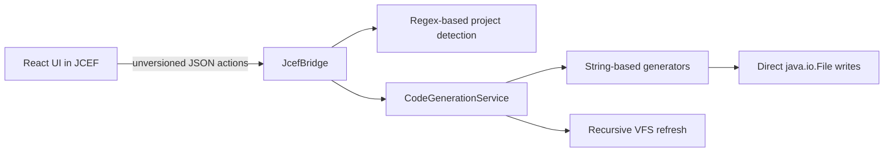
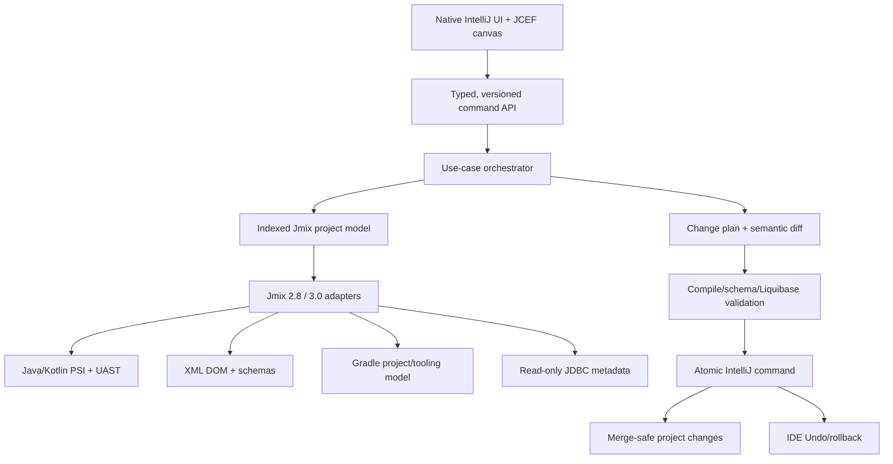

# Jmix Visual Development Workbench: Deep Assessment

**Assessment date:** 2026-07-27  
**Project assessed:** `jmix-studio-clone/`  
**Research baseline:** Jmix Studio 3.0.1 / Jmix 3.0, IntelliJ IDEA 2025.3–2026.2

## 1. Executive Verdict

The current project is a **UI and code-generation prototype**, not an installable or safe Jmix Studio replacement.

It has a useful visual concept and a meaningful amount of draft implementation, but it is not ready for personal production use, team use, or enterprise use. The most important conclusion is:

> **Enterprise recommendation: NO-GO. Do not run the current generator against a valuable Jmix repository.**

The reasons are release-blocking:

- The React UI builds, but the IntelliJ plugin is not currently buildable from this checkout.
- The plugin targets IntelliJ 2024.1–2025.1 while current Jmix Studio requires IntelliJ 2025.3 or newer.
- The source contains a Kotlin compile blocker in the view generator.
- Some visible UI commands have no backend implementation.
- Existing Jmix artifacts are not parsed, indexed, or round-tripped.
- Whole files are overwritten or raw XML fragments are appended without structural merging.
- Generation is not atomic and has no rollback, conflict detection, preview diff, or backup.
- There are no tests, CI checks, plugin-verifier checks, release signing, or compatibility tests.
- Jmix 2.8 LTS and Jmix 3.0 require separate version-aware generation and migration rules; the prototype defaults to Jmix 2.4.

The correct direction is not to reproduce the paid plugin byte-for-byte. It is to build an **original, clean-room, feature-compatible Jmix development workbench** using public Jmix documentation, public XML schemas, the open-source Jmix framework, and IntelliJ Platform APIs.

## 2. Legal and Product Boundary

Jmix Framework is open source, while Jmix Studio and commercial add-ons are separately licensed products. The official pricing page currently provides free Community tooling and makes Sprint visual tooling free for projects up to 10 entities and 10 roles; larger projects require a named subscription. The current published prices are USD 1,149/year or USD 119/month for Sprint, USD 1,449/year for Enterprise, and USD 1,930/year for BPM, excluding VAT.

Sources:

- [Jmix plans, current prices, and free small-project limit](https://www.jmix.io/subscription-plans-and-prices/)
- [Jmix commercial software license](https://www.jmix.io/commercial-software-license/)
- [Official Studio feature catalog](https://docs.jmix.io/jmix/studio/studio-features.html)

A safe project boundary is:

- Implement the same *categories of developer workflow* from public specifications.
- Write original UI, models, parsers, generators, tests, and documentation.
- Do not decompile, patch, call into, copy assets from, or bypass licensing in the commercial Studio plugin.
- Do not copy Jmix Studio branding or create a pixel-identical UI.
- Rename this project and add a trademark disclaimer such as “Compatible with Jmix; not affiliated with or endorsed by Haulmont.”
- Do not claim that a visual BPMN editor includes the commercial Jmix BPM runtime. BPMN authoring and a BPM engine are separate products.
- Use open alternatives where a commercial runtime is out of scope, for example a separately integrated open-source Flowable runtime.

This is a product-engineering boundary, not legal advice. Before public distribution, obtain an intellectual-property review.

## 3. What the Current Project Actually Contains

The snapshot contains approximately 9,700 lines under `plugin/src`, `webui/src`, and plugin resources:

- Kotlin IntelliJ plugin shell and JCEF bridge.
- React/TypeScript visual workbench.
- In-memory entity, view, migration, role, and project models.
- String-based Java and XML builders.
- Generators for entities, CRUD views, migrations, roles, menus, repositories, events, and BPMN.
- UI panels for entity, view, CRUD, menu, role, and migration workflows.

It does **not** contain:

- A Git repository in this checkout.
- A license file, despite the README claiming the project is open source.
- A complete Gradle wrapper.
- Automated tests.
- CI/CD or plugin signing.
- A released plugin ZIP.
- A real semantic Jmix project model.
- Database connectivity or reverse engineering.
- IntelliJ PSI/UAST-based source parsing and editing.
- XML DOM-based round-trip editing.
- Kotlin source generation.
- Multi-module or composite-project support.

### Verified build result

| Check | Result | Meaning |
|---|---|---|
| `npm run build` | **Pass** | TypeScript and Vite bundle successfully. |
| IntelliJ plugin build with system Gradle 9.4.1 | **Fail before compilation** | `org.jetbrains.intellij` 1.17.4 is incompatible with the available Gradle version. |
| Repository Gradle wrapper | **Incomplete** | Wrapper properties exist, but launcher scripts and wrapper JAR are absent. |
| Kotlin source inspection | **Compile blocker found** | `generateDataGridContent(...)` is called, but only `generateDataGridContents(...)` exists. |
| Tests | **None** | Effective automated behavioral coverage is zero. |

## 4. Current Architecture

This is adequate for a disposable demo. It is not adequate for a source-aware IDE plugin because the generated files are treated as anonymous text rather than structured Java/Kotlin/XML/properties artifacts.

## 5. Critical Verified Findings

### P0 — Plugin cannot be shipped

The build targets the obsolete Gradle IntelliJ plugin 1.17.4 and IntelliJ 2024.1. The declared compatibility ends at build 251.*, while current Jmix 3 requires IntelliJ 2025.3+. JetBrains now recommends IntelliJ Platform Gradle Plugin 2.x for platform 2024.2+, and IntelliJ 2026.2 introduces Java 25 and an explicit JCEF module dependency.

Evidence:

- `plugin/build.gradle.kts`
- `plugin/gradle.properties`
- `plugin/src/main/resources/META-INF/plugin.xml`
- [Jmix 3.0 release requirements](https://docs.jmix.io/jmix/whats-new/release-3.0.html)
- [Jmix current setup requirements](https://docs.jmix.io/jmix/setup.html)
- [JetBrains 2026.2 plugin guidance](https://platform.jetbrains.com/t/2026-2-is-coming-time-to-check-your-plugin-compatibility/4618)

### P0 — View generator contains an unresolved function call

`ViewXmlGenerator` calls `generateDataGridContent(...)`, while the declared function is `generateDataGridContents(...)`. This prevents Kotlin compilation once the build reaches source compilation.

Evidence: `plugin/src/main/kotlin/com/jmixstudio/generator/ViewXmlGenerator.kt`

### P0 — Existing project entities are never loaded

The `getEntities` bridge action is a TODO and always returns an empty list. Therefore, the workbench cannot select, inspect, edit, or scaffold from the real data model of an existing project.

Evidence: `plugin/src/main/kotlin/com/jmixstudio/bridge/JcefBridge.kt`

### P0 — Menu generation is visibly broken

The Menu Designer sends `generateMenu`; the Kotlin bridge has no `generateMenu` action. The backend therefore returns an unknown-action error.

Evidence:

- `webui/src/components/MenuDesigner/MenuDesigner.tsx`
- `plugin/src/main/kotlin/com/jmixstudio/bridge/JcefBridge.kt`

### P0 — Current writes can corrupt or erase project configuration

The service uses `File.writeText()` for generated paths. CRUD generation includes `menu.xml`, `messages.properties`, and fetch-plan output among those writes, which can replace existing team-maintained files. Other paths use `appendText()` to append a complete standalone `<item>` after an existing XML document, which produces malformed XML rather than inserting a child node.

There is no:

- Existing-file parse.
- Semantic merge.
- Duplicate detection.
- Preview diff.
- User confirmation.
- Atomic multi-file transaction.
- Rollback after a later file fails.
- Generated-file ownership marker.
- Conflict resolution.

Evidence: `plugin/src/main/kotlin/com/jmixstudio/services/CodeGenerationService.kt`

### P0 — Path boundary is not enforced

Paths are constructed from bridge-supplied class, package, view, migration, and process identifiers and passed to `File(projectRoot, relativePath)`. The service does not normalize the result and verify that it remains under the intended project/module root. The React UI is not a security boundary because callers can invoke the JCEF bridge directly.

An enterprise implementation must validate identifiers, reject separators and traversal segments, resolve canonical paths, and verify `resolvedPath.startsWith(allowedRoot)`.

### P0 — Generated roles lack a Java package declaration

The service writes roles under `<basePackage>/security`, but `RoleGenerator` explicitly builds both role types with an empty package. The filesystem location and source declaration are inconsistent.

Evidence:

- `plugin/src/main/kotlin/com/jmixstudio/generator/RoleGenerator.kt`
- `plugin/src/main/kotlin/com/jmixstudio/services/CodeGenerationService.kt`

### P0 — Several advertised default generation flows cannot produce valid output

The deeper generator audit found multiple independent blockers:

- The TypeScript wire values for view components, containers, facets, actions, and CRUD options do not consistently map to Kotlin enum constants. Gson therefore cannot reliably deserialize normal default UI payloads.
- Manual migrations send discriminated TypeScript objects into a Kotlin sealed `DbChange` hierarchy without a polymorphic Gson adapter.
- `JavaClassBuilder.extends_()` and `implements_()` treat rendered type expressions as import names, producing invalid imports such as `import JpaRepository<Customer, UUID>;`.
- View XML namespace handling can emit `xmlns:=...` and duplicate namespace declarations.
- Default `standardEntity` generation can emit an invalid simple-name import.
- To-many associations are modeled as scalar entity fields rather than collections.
- Embedded/composite IDs are placeholders and do not generate a matching ID class or multi-column migration.
- BPMN conditional expressions use the `xsi` prefix without declaring its namespace.

These are not edge cases; several occur on the designers' default paths. Detailed evidence is recorded in `.planning/codebase/CONCERNS.md`.

### P1 — The bridge protocol is unsafe and unreliable

The bridge has:

- No request ID, so concurrent requests for the same action can resolve the wrong promise.
- No protocol version.
- No schema validation.
- No payload size or depth limit.
- No timeout or cancellation.
- Hand-built JSON for errors.
- Raw action/result interpolation into executable JavaScript.
- No origin check before exposing file-writing commands to the loaded page.
- An unrestricted development URL controlled by a JVM property.

Errors or crafted data containing quotes, backslashes, newlines, or script syntax can break response dispatch. The target design should pass encoded JSON data through a typed dispatcher instead of building executable JavaScript strings.

### P1 — Project discovery is heuristic and single-module only

The plugin reads only the root `build.gradle` or `build.gradle.kts`, performs regular-expression and substring matching, assumes `src/main/java` and `src/main/resources`, defaults to PostgreSQL and Jmix 2.4, and caches indefinitely unless manually refreshed.

It cannot correctly model:

- Gradle multi-project builds.
- Composite builds.
- Add-on functional/starter modules.
- Kotlin-only projects.
- Custom source sets.
- Version catalogs.
- Plugin aliases.
- Profile-specific properties.
- Multiple data stores.
- Generated sources.
- Included builds.

The official Studio explicitly supports composite projects and prevents circular subproject dependencies.

Source: [Jmix Composite Projects](https://docs.jmix.io/3.x/jmix/studio/composite-projects.html)

### P1 — Generator output is not version-aware

Jmix 2.8 is an LTS line; Jmix 3.0 moved to Spring Boot 4, Vaadin 25.1, EclipseLink 5, Flowable 8, Gradle 9.5.1, and Java 21/25, with breaking changes and automated migrations. A generator that emits one fixed API shape cannot safely support both lines.

Source: [Jmix 3.0 release and migration changes](https://docs.jmix.io/jmix/whats-new/release-3.0.html)

### P1 — UI preview is schematic, not Jmix-runtime accurate

The View Designer draws React approximations. It does not render the actual Jmix/Vaadin component implementation, validate the descriptor against the installed Jmix version, resolve add-on components, or round-trip manual XML/controller edits.

Official Studio supports simultaneous text/design workflows and project-aware component structure. It is not merely a palette-to-string generator.

Source: [Official View Designer](https://docs.jmix.io/jmix/studio/view-designer.html)

### P1 — No quality or release system

There are no:

- Kotlin unit tests.
- Golden generator tests.
- React component tests.
- IntelliJ light-fixture tests.
- Full IDE integration tests.
- End-to-end JCEF tests.
- Generated Jmix fixture compilation tests.
- Liquibase validation tests.
- Database matrix tests.
- Performance or UI-freeze tests.
- Plugin Verifier task.
- CI jobs.
- Coverage thresholds.
- Signed builds, SBOM, dependency scanning, or release channel.

JetBrains specifically recommends full-product integration tests for plugin user stories and Plugin Verifier for platform compatibility.

Sources:

- [JetBrains integration tests](https://plugins.jetbrains.com/docs/intellij/integration-tests.html)
- [JetBrains Plugin Verifier](https://plugins.jetbrains.com/docs/intellij/verifying-plugin-compatibility.html)

## 6. Official Feature Comparison

Legend:

- **Missing** — no material implementation.
- **Prototype** — UI/model/string generation exists but is not project-aware or safe.
- **Broken** — visible path is known not to work.
- **Partial** — some useful behavior exists but lacks round-trip or major required capabilities.

| Official Jmix Studio capability | Current project | Main gap |
|---|---|---|
| Welcome screen and project creation | Missing | No project wizard, templates, or build scaffolding. |
| Semantic Jmix tool window | Missing | Only one generic workbench; no indexed artifact tree. |
| Project properties and version upgrade | Missing | Read-only regex guesses; no controlled Gradle/property edits or migrations. |
| Add-ons marketplace/dependencies | Missing | No catalog, dependency graph, or Gradle sync. |
| Composite projects | Missing | Root-only, single-module assumptions. |
| Profile-specific properties and `.env` | Missing | No property model. |
| Data stores and JDBC drivers | Missing | No connection, credential storage, schema inspection, or multiple stores. |
| Entity/DTO/enum designer | Prototype | Create-only; no PSI parsing, existing-source editing, inherited/add-on metadata, or bidirectional sync. |
| Database schema migration generation | Prototype | Can emit changelog text; no schema diff, master include update, collision control, or validation. |
| Database reverse engineering | Missing | No JDBC metadata or database-first wizard. |
| Partial reverse engineering | Missing | Cannot add a DB column to an existing entity. |
| View creation wizard | Prototype | Static new-file generation only; no real entity catalog or repository/update-service integration. |
| WYSIWYG View Designer | Prototype | Schematic React preview; no descriptor/controller round-trip or actual Jmix preview. |
| Fetch Plan Designer | Missing | Model support and CRUD output are not a user-facing round-trip designer. |
| Menu Designer | Broken | UI action is not implemented in the bridge; no structural XML merge. |
| Resource Role Designer | Prototype | Generates incomplete/invalid source and lacks inherited policies/attribute matrix. |
| Row-level Role Designer | Prototype | Basic forms/string generation; no semantic validation or predicate code workflow. |
| Coding assistance | Missing | No completion, references, inspections, intentions, quick fixes, or refactoring. |
| Code snippets | Missing | No context-aware templates. |
| JPQL Designer | Missing | No query AST/editor, metadata completion, or validation. |
| Hot deploy | Missing | No compiler integration, trigger files, cache signals, or status indicator. |
| BPMN/DMN modeler | Missing | One backend BPMN template generator is not exposed as a modeler and provides no engine. |
| OpenAPI client generation | Missing | No schema import, client generation, entities, mappers, or service layer. |
| Data repository support | Partial | Basic Spring repository text only; not version-aware Jmix repository workflow. |
| AI Assistant / Agent Toolkit | Missing | No project-aware AI tools, local model context, or controlled actions. |
| Custom project templates | Missing | No template artifact discovery or template versioning. |
| Quick cloud deployment | Missing | No deployment flow. |

Official feature references:

- [Studio feature catalog](https://docs.jmix.io/jmix/studio/studio-features.html)
- [Entity Designer](https://docs.jmix.io/jmix/studio/entity-designer.html)
- [View Creation Wizard](https://docs.jmix.io/jmix/studio/view-wizard.html)
- [View Designer](https://docs.jmix.io/jmix/studio/view-designer.html)
- [Fetch Plan Designer](https://docs.jmix.io/jmix/studio/fetch-plan-designer.html)
- [Menu Designer](https://docs.jmix.io/jmix/studio/menu-designer.html)
- [Role Designer](https://docs.jmix.io/jmix/studio/role-designer.html)
- [Coding Assistance](https://docs.jmix.io/jmix/studio/coding-assistance.html)
- [JPQL Designer](https://docs.jmix.io/jmix/studio/jpql-designer.html)
- [Reverse Engineering](https://docs.jmix.io/jmix/studio/reverse-engineering.html)
- [OpenAPI Client Generation](https://docs.jmix.io/jmix/studio/openapi-client.html)

## 7. Enterprise Suitability

| Dimension | Status | Enterprise interpretation |
|---|---|---|
| Build and installation | **Blocked** | There is no reproducible plugin artifact. |
| Functional completeness | **Prototype** | A small subset of create-new flows is represented. |
| Existing-project support | **Absent** | Cannot understand or safely modify a real codebase. |
| Data-loss protection | **Unsafe** | Overwrite/append behavior can damage source and XML. |
| Correctness assurance | **Absent** | No behavioral tests or generated-project compilation matrix. |
| Jmix version compatibility | **Obsolete** | Defaults to 2.4 and misses 2.8 LTS/3.0 adapters. |
| IntelliJ compatibility | **Obsolete** | Targets 2024.1–2025.1, not the current supported baseline. |
| Multi-module scalability | **Absent** | No Gradle project graph or composite builds. |
| Security | **High risk** | Unvalidated bridge payloads and paths reach filesystem writes. |
| Performance | **Unproven** | Project reads and recursive refreshes are not indexed or benchmarked. |
| Team collaboration | **Absent** | No merge-safe edits, deterministic output contract, or shared settings. |
| Operations and governance | **Absent** | No CI, signing, SBOM, audit trail, telemetry policy, or support process. |

The plugin would need to pass all of the following before enterprise use:

1. Reproducible signed build.
2. Zero P0 correctness/security findings.
3. Safe preview-first, atomic, undoable changes.
4. Real round-trip support for existing artifacts.
5. Jmix 2.8 LTS and 3.0 fixture compilation.
6. IntelliJ 2025.3, 2026.1, and 2026.2 compatibility verification.
7. Unit, integration, and end-to-end tests.
8. Large multi-module project performance tests.
9. Threat model, dependency policy, SBOM, and release provenance.
10. Pilot use on disposable projects before any production repository.

## 8. Recommended Clean-Room Architecture

### 8.1 Plugin platform layer

- Kotlin plugin based on IntelliJ Platform Gradle Plugin 2.x.
- Baseline IntelliJ 2025.3.1+; decide whether 2026.2 is a separate artifact because of JCEF dependency and Java 25 changes.
- Explicit dependencies on Platform, Java, XML, Gradle, Kotlin (optional), and JCEF modules.
- Native IntelliJ UI for ordinary settings/forms; JCEF only for visual canvases where it provides clear value.
- Proper disposables, coroutines/background tasks, cancellation, progress, dumb-mode handling, and action update threads.

JetBrains recommends Swing/native IDE UI by default and JCEF when normal UI is insufficient. PSI/VFS reads and writes must follow the platform threading model.

Sources:

- [Embedded Browser/JCEF guidance](https://plugins.jetbrains.com/docs/intellij/embedded-browser-jcef.html)
- [IntelliJ threading model](https://plugins.jetbrains.com/docs/intellij/threading-model.html)
- [Modifying PSI](https://plugins.jetbrains.com/docs/intellij/modifying-psi.html)
- [Virtual File System](https://plugins.jetbrains.com/docs/intellij/virtual-file-system.html)

### 8.2 Semantic project model

Build a project index containing:

- Gradle builds, modules, included builds, source sets, dependencies, and Jmix versions.
- Jmix applications, add-ons, functional/starter modules, and `@JmixModule` dependency graph.
- Entities, inheritance, traits, attributes, associations, indexes, DTOs, and enums.
- Views, fragments, descriptors, controllers, routes, actions, facets, and data bindings.
- Fetch plans, menus, message bundles, roles, data stores, changelogs, repositories, services, and add-on components.

The index must update incrementally from PSI/VFS/Gradle events. Do not recursively scan the whole project on every action.

### 8.3 Version adapters

Define a stable internal model and adapters:

- `Jmix28Adapter` for the 2.8 LTS line.
- `Jmix30Adapter` for Jmix 3.x.
- IntelliJ platform adapters if one plugin binary cannot safely span the desired IDE range.
- Component/add-on catalogs resolved from the target project classpath, not hard-coded lists.

Each adapter owns:

- Supported annotations and APIs.
- XML namespaces/schemas and allowed attributes.
- View/controller templates.
- Security policy APIs.
- Repository/update-service patterns.
- Gradle and dependency edits.
- Migration rules.

### 8.4 Round-trip parsing and editing

- Use Java PSI and Kotlin PSI/UAST for source.
- Use XML PSI/DOM for descriptors, menus, fetch plans, and Liquibase.
- Use properties-file PSI for message bundles.
- Use Gradle-aware models plus conservative PSI edits for build scripts.
- Preserve comments, formatting, unknown attributes, custom code, and manual ordering.
- Generate new files from templates, but update existing files semantically.

### 8.5 Safe change engine

Every UI action should produce a `ChangePlan`:

- Files to create.
- Structured modifications.
- Before/after diff.
- Validation results.
- Conflicts and destructive changes.

Application rules:

- Validate all identifiers and paths.
- Refuse writes outside declared module roots.
- Refuse silent overwrite.
- Stage all contents before writing.
- Validate Java/Kotlin parse, XML schema, unique IDs, menu references, fetch-plan references, and Liquibase structure.
- Apply in one IntelliJ command where practical.
- Support IDE Undo and rollback if any operation fails.
- Run code formatting and optimize imports after PSI changes.

### 8.6 Typed bridge

If React/JCEF remains:

- Generate Kotlin and TypeScript contracts from one JSON Schema or protobuf-like IDL.
- Include `protocolVersion`, `requestId`, `action`, and typed payload/result.
- Add timeouts, cancellation, payload limits, structured error codes, and progress events.
- Allow-list commands.
- Check trusted origin/resource scheme before installing privileged commands.
- Encode data; never interpolate untrusted values into executable JavaScript.
- Keep filesystem operations behind the Kotlin service boundary.

### 8.7 Validation laboratory

Maintain small fixture projects for:

- Jmix 2.8 Java.
- Jmix 2.8 mixed Java/Kotlin.
- Jmix 3.0 Java.
- Jmix 3.0 mixed Java/Kotlin.
- Single-module application.
- Multi-module application.
- Composite add-on/application project.
- PostgreSQL, MySQL/MariaDB, SQL Server, Oracle, and HSQLDB migration output.

For each generated feature:

1. Golden-output test.
2. PSI/XML parse test.
3. Compile generated fixture.
4. Run Jmix integration test.
5. Where relevant, start the application and exercise the view.

## 9. Recommended Delivery Roadmap

### Phase 0 — Product and legal reset

**Goal:** establish an original, distributable project.

- Rename project and packages.
- Add license, trademark disclaimer, contribution policy, and clean-room rules.
- Initialize version control.
- Define supported matrix: Jmix 2.8 LTS and/or 3.0, Java/Kotlin, IntelliJ versions.
- Replace README claims with verified status.
- Produce a threat model and architectural decision records.

**Exit gate:** legally clear scope and reproducible empty plugin build.

### Phase 1 — Platform foundation and safe edits

**Goal:** make the plugin trustworthy before adding features.

- Upgrade plugin build and restore Gradle wrapper.
- Add Plugin Verifier and CI.
- Implement typed bridge.
- Implement module/project discovery.
- Implement `ChangePlan`, diff preview, validation, atomic apply, and Undo.
- Add path containment, input validation, and trusted-origin controls.
- Add unit and IntelliJ fixture tests.

**Exit gate:** safe create/update of a harmless test artifact across supported IDEs.

### Phase 2 — Data model vertical slice

**Goal:** production-quality entity workflow.

- Entity/DTO/enum index and round-trip designer.
- Java and Kotlin support.
- Traits, inherited attributes, associations, compositions, validations, indexes, and localization.
- Data repositories/update services.
- Data stores, read-only JDBC schema introspection, and Liquibase semantic diff.
- Jmix 2.8/3.0 adapters.

**Exit gate:** existing source ↔ designer ↔ source round trip with no unrelated diff.

### Phase 3 — UI vertical slice

**Goal:** complete CRUD/view workflow.

- View wizard templates.
- Descriptor/controller round-trip.
- Fetch Plan Designer.
- Menu Designer with structural merge.
- Component catalog from installed Jmix/add-ons.
- Actual descriptor validation and optional running-app preview.

**Exit gate:** generate, edit, compile, run, reopen, and round-trip a CRUD feature.

### Phase 4 — Developer intelligence

**Goal:** reach IDE-productivity parity rather than just code generation.

- Jmix inspections, intentions, quick fixes, references, completion, navigation, and safe refactoring.
- JPQL AST designer and validator.
- Hot deploy with compilation/progress/status.
- Database reverse engineering.
- OpenAPI import/client/entity/mapper/service flow.

**Exit gate:** measurable productivity improvement on a representative enterprise fixture.

### Phase 5 — Enterprise scale

**Goal:** team and large-codebase readiness.

- Composite projects and add-on dependency graph.
- Profiles, `.env`, multiple data stores, custom source sets, and internal artifact repositories.
- Shared settings and deterministic output.
- Performance budgets and large-project benchmarks.
- Signed release, SBOM, dependency scanning, private update channel, audit logs, and support runbook.
- Accessibility and internationalization of the plugin UI.

**Exit gate:** controlled pilot in a real team repository.

### Phase 6 — Optional BPM and AI

- BPMN/DMN authoring can be added as an independent capability.
- A commercial Jmix BPM runtime cannot be replaced by generating an XML file; use a properly licensed runtime or an explicitly supported open alternative.
- AI should operate through the same typed, previewable `ChangePlan` system, never direct arbitrary file writes.

## 10. Realistic Effort

This is the scope of an IDE product, not a small plugin.

Approximate effort for experienced IntelliJ/Jmix engineers:

| Target | Indicative effort |
|---|---:|
| Buildable, safe foundation | 6–10 engineer-weeks |
| Reliable entity + Liquibase vertical slice | 10–16 engineer-weeks |
| Reliable CRUD/view/fetch/menu vertical slice | 14–22 engineer-weeks |
| Coding assistance, JPQL, reverse engineering, OpenAPI, hot deploy | 20–36 engineer-weeks |
| Composite-project, release, security, performance, enterprise hardening | 16–28 engineer-weeks |
| Full broad parity and ongoing Jmix/IntelliJ compatibility | Multi-year product commitment |

AI assistance can reduce boilerplate and research time, but it does not remove the need for version matrices, integration testing, real-project pilots, and maintenance as Jmix and IntelliJ evolve.

For one developer, a credible personal MVP is possible. Full paid-Studio breadth plus enterprise reliability is not realistic as a short solo project.

## 11. Recommended Approval Scope

Do **not** approve implementation of all README features at once.

Approve this first milestone:

> **Foundation milestone:** rename and license the project, make the IntelliJ plugin build on the current platform, add CI/tests/plugin verification, implement a typed and secured bridge, build a real semantic project/module index, and replace direct writes with previewable atomic change plans.

Only after that milestone passes should the existing Entity Designer be rebuilt as the first complete vertical slice.

## 12. Final Recommendation

Keep the React design work as a prototype/reference, and salvage pure model/generator ideas only after tests prove them. Replace the core integration and mutation architecture.

The viable product is:

> An original IntelliJ plugin that understands Jmix 2.8/3.x projects semantically, exposes visual workflows, and applies validated, merge-safe, undoable changes.

The non-viable product is:

> A browser form that accepts object models and writes generated strings directly into an enterprise repository.
