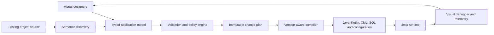

# Full-GUI Enterprise Development Requirements

The atomic Studio-parity, enterprise-superiority, and certification completion
gates are maintained in `JMIX-STUDIO-SURPASS-LEDGER.md`. That ledger is
normative and must be satisfied together with this document.

## 1. Purpose

This document defines the capabilities required for Jmix Visual Development
Workbench to support end-to-end development of complex Jmix products through
graphical tools.

The target is not limited to screen scaffolding. The workbench must allow teams
to visually model, generate, inspect, test, debug, operate, and evolve the
application as a connected system of:

- domain data;
- user interfaces;
- business logic;
- workflows;
- security;
- integrations;
- database changes;
- tests;
- deployment and operational behavior.

The intended scale includes large, multi-module systems used by banks, NGOs,
governments, multinational organizations, and other regulated enterprises.

Normative terms such as **MUST**, **SHOULD**, and **MAY** describe mandatory,
recommended, and optional behavior.

## 2. Product Promise

For every supported operation, a developer MUST be able to:

1. discover the relevant existing artifacts;
2. understand their relationships and runtime impact;
3. make a change visually;
4. preview the complete change plan and source diff;
5. validate compatibility, security, and data-safety constraints;
6. apply the change atomically;
7. undo or revert it safely;
8. test and debug the resulting behavior visually.

A developer SHOULD be able to deliver supported application behavior without
manually editing Java, Kotlin, XML, SQL, YAML, properties, Gradle, or deployment
files.

The workbench MAY generate these artifacts internally, but generated output
MUST remain readable, deterministic, version-controlled, and compatible with
normal IntelliJ IDEA development.

## 3. Non-Negotiable Design Principles

### 3.1 Visual-first, not visual-only storage

The visual model MUST compile to normal Jmix project artifacts. Projects MUST
remain buildable, testable, and deployable without the workbench being present
at runtime.

### 3.2 Round-trip safety

Visual edits MUST preserve compatible manual code and formatting. Manual
changes MUST be rediscovered and represented in the visual model whenever they
can be understood safely.

The workbench MUST never silently replace an existing source file with a
generated approximation.

### 3.3 Preview before mutation

Every mutation MUST produce a typed, immutable change plan containing:

- affected modules and files;
- before and after revisions;
- structured edits;
- generated artifacts;
- validation results;
- compatibility requirements;
- security and migration warnings;
- rollback information.

Applying a stale plan MUST be blocked.

### 3.4 Version-aware generation

Jmix, Java, Kotlin, IntelliJ Platform, Vaadin, Spring, database, and add-on
differences MUST be handled through explicit compatibility adapters.

Unsupported combinations MUST be reported honestly. The workbench MUST not
guess when a change could corrupt a valuable project.

### 3.5 One connected application model

Screens, entities, services, security, workflows, REST endpoints, database
objects, tests, and deployment configuration MUST be represented in one
cross-module application graph.

### 3.6 Enterprise governance

Visual development MUST retain the same reviewability, traceability, access
control, testing discipline, and auditability expected from source development.

### 3.7 Clean-room implementation

The product MUST use original implementation code and public contracts. It
MUST NOT copy proprietary Jmix Studio code, assets, or internal behavior, and
MUST NOT bypass third-party licensing.

## 4. Core Architecture

The platform MUST use a typed intermediate representation rather than directly
concatenating source strings.

The typed model MUST describe:

- data types, nullability, generics, and collections;
- entity identity and persistence semantics;
- function inputs, outputs, exceptions, and side effects;
- transactions and consistency boundaries;
- synchronous, asynchronous, and scheduled execution;
- authorization requirements;
- external resources and secrets;
- compatibility and source ownership;
- test contracts and runtime observability.

## 5. Visual Domain and Data Designer

The workbench MUST support visual creation and round-trip editing of:

- Jmix entities, DTOs, embeddables, mapped superclasses, enums, and projections;
- identifiers, version fields, audit traits, soft deletion, and tenancy fields;
- attributes, associations, compositions, inheritance, and cardinality;
- bean validation and reusable server-side validation;
- indexes, unique constraints, foreign keys, checks, sequences, and defaults;
- fetch plans, data containers, loaders, JPQL, sorting, filtering, and paging;
- multiple data stores and cross-store references;
- entity listeners, events, calculated attributes, and lifecycle behavior.

The designer MUST show the impact of a change across all modules before it is
applied.

Financial values MUST default to exact decimal types. Unsafe floating-point
money fields MUST produce blocking or high-severity findings.

## 6. Full FlowUI Screen Designer

The screen designer MUST treat a view as a connected unit of layout, data,
security, workflow, validation, navigation, and service logic.

Required capabilities include:

- canvas and component tree editing;
- drag-and-drop layouts, forms, grids, tabs, dialogs, filters, actions,
  uploads, charts, and custom components;
- responsive constraints and desktop, tablet, mobile, and low-bandwidth
  previews;
- entity and DTO binding;
- data-container, loader, fetch-plan, query, parameter, and action editing;
- localization and formatting;
- visibility, enablement, read-only, and required-state rules;
- controller lifecycle events and component events;
- accessibility inspection and keyboard navigation;
- theme tokens and reusable design-system components;
- real runtime preview with safe hot reload.

The designer MUST identify behavior contributed by custom source code and MUST
allow navigation from the visual element to the exact source location.

## 7. Visual Programming Language

To eliminate routine Java/Kotlin authoring, the workbench MUST provide a typed
visual programming language.

### 7.1 Required language capabilities

The visual language MUST support:

- constants, variables, parameters, and return values;
- primitive, entity, DTO, enum, collection, map, optional, and temporal types;
- expressions, formulas, comparisons, and null-safe operations;
- conditions, switches, loops, iteration, and early return;
- reusable functions and typed subflows;
- recursion with safety limits;
- exception handling, retry, compensation, and finalization;
- synchronous and asynchronous operations;
- parallel branches and synchronization;
- transactions and propagation settings;
- events, schedules, queues, and background work;
- authorization checks and security context;
- logging, metrics, tracing, and audit events.

### 7.2 Domain-specific nodes

The standard node library MUST include:

- load, query, create, update, save, and delete entity;
- aggregate, join, filter, map, reduce, group, and sort data;
- call service, repository, workflow, endpoint, or reusable flow;
- validate data and permissions;
- publish and consume events;
- create notification, document, report, or task;
- start, commit, suspend, and roll back transaction;
- apply idempotency and distributed-lock policies;
- call integration connectors;
- transform and map structured payloads.

### 7.3 Complexity management

Large flows MUST support:

- collapsible subflows;
- reusable modules;
- typed contracts;
- automatic layout;
- dependency and cycle visualization;
- complexity limits and linting;
- documentation generated from the graph;
- ownership and approval metadata.

Visual logic MUST NOT become an unreviewable collection of unstructured nodes.

## 8. Formula, Decision, and Rules Designers

Different business problems require different visual representations.

The workbench MUST provide:

- spreadsheet-style formulas for calculations;
- decision tables for policy and eligibility rules;
- decision trees for guided outcomes;
- rule sets with priority and conflict resolution;
- temporal rules and effective dates;
- state machines for lifecycle behavior;
- data pipelines for transformation and reconciliation.

Rules MUST be executable on the server. A critical business or financial rule
MUST NOT exist only in the browser or view controller.

Rules MUST be reusable, versioned, testable, explainable, and traceable to the
decision that used them.

## 9. Workflow and Case Management

The workbench MUST visually model:

- states, transitions, actors, groups, and organizational scopes;
- approvals, rejection, cancellation, escalation, delegation, and rework;
- required documents and validations;
- timers, service tasks, messages, and subprocesses;
- notifications and side effects;
- compensation and recovery;
- process version migration;
- ad hoc case-management tasks.

It MUST flag direct state changes that bypass the declared workflow.

Developers MUST be able to simulate a workflow with selected users, roles,
dates, and failure conditions before deployment.

## 10. Integration Designer

The integration workbench MUST support visual import, configuration, testing,
and monitoring of:

- REST and OpenAPI;
- GraphQL;
- SOAP and WSDL;
- webhooks;
- Kafka and RabbitMQ;
- SFTP and managed file transfer;
- relational databases and stored procedures;
- email, SMS, and push notification providers;
- payment gateways and banking systems;
- identity providers and directory services;
- object storage and document-management platforms.

Every connector MUST support, where applicable:

- authentication and authorization;
- secret references without exposing secret values;
- request and response mapping;
- validation and schema evolution;
- timeouts and cancellation;
- retry and exponential backoff;
- idempotency;
- circuit breaking and rate limiting;
- transaction outbox and inbox patterns;
- dead-letter handling;
- reconciliation;
- metrics, logs, traces, and alerting.

### 10.1 Visual connector builder

For an integration without a prebuilt connector, authorized platform engineers
MUST be able to create a reusable connector through the GUI using protocol,
authentication, serialization, transport, mapping, reliability, and
observability primitives.

Connectors MUST be packageable, versioned, signed, reviewed, and published to
an organization catalog.

## 11. Jmix and Spring Extension Designer

The GUI MUST expose supported Jmix and Spring extension points, including:

- view lifecycle and component events;
- entity listeners and application events;
- data loader delegates;
- validators and access constraints;
- repositories and DataManager operations;
- bean specialization and replacement;
- scheduled jobs and background tasks;
- REST services;
- workflow callbacks;
- custom actions, facets, and components;
- configuration properties and profiles.

The generated implementation MUST use the correct APIs for the detected Jmix
and Java version.

## 12. Security and Privacy Designer

The workbench MUST visually model and evaluate:

- resource roles and row-level roles;
- menu, view, entity, attribute, action, and REST permissions;
- role inheritance and organizational scope;
- segregation of duties;
- multi-tenancy;
- field masking and sensitive-data classification;
- consent, retention, deletion, and legal-hold policies;
- service accounts and machine-to-machine access.

It MUST calculate effective access and allow a developer to test the
application as a selected user, role set, organization, branch, and tenant.

Warnings MUST cover:

- wildcard or global CRUD access;
- uncovered menus and views;
- menu/view permission mismatches;
- unconstrained data access;
- missing row restrictions;
- conflicting or unreachable policies;
- privileged endpoints without authorization;
- secrets stored in source or visual models.

## 13. Database and Migration Designer

The database workbench MUST provide:

- entity-to-schema and schema-to-entity comparison;
- live schema inspection through controlled connections;
- versioned Liquibase changesets;
- indexes, constraints, sequences, views, and stored objects;
- safe data migrations;
- forward and rollback planning;
- database-specific compatibility analysis;
- lock, downtime, table-scan, and data-loss risk estimation;
- migration ordering across modules and services;
- production drift detection.

Destructive or non-reversible changes MUST require explicit acknowledgement and
stronger review policy.

## 14. API and Service Designer

Developers MUST be able to visually define:

- service operations and transactional boundaries;
- REST and GraphQL endpoints;
- input and response contracts;
- validation and authorization;
- pagination, filtering, and sorting;
- error models and compatibility policy;
- OpenAPI documentation;
- rate limits and idempotency;
- saved invocation payloads and expected entity changes.

The workbench MUST support contract testing, mock providers, and consumer
compatibility analysis.

## 15. Visual Testing and Scenario Builder

The workbench MUST generate and execute:

- unit tests for visual functions and rules;
- integration tests for services and persistence;
- workflow simulations;
- UI journeys;
- API contract tests;
- migration tests;
- security-access tests;
- integration failure and recovery tests;
- load and batch-processing scenarios.

Scenarios MUST support isolated seed data and assertions over:

- entity state;
- balances and ledger entries;
- schedules;
- workflow state;
- emitted events;
- notifications;
- external requests;
- audit records.

A representative enterprise scenario is:

`approve loan -> disburse -> post ledger -> deduct installment -> reconcile ->
early settle -> close account`

## 16. Visual Debugger and Runtime Inspection

Developers MUST be able to:

- set breakpoints on visual nodes;
- step into flows, rules, services, workflows, and integrations;
- inspect variables and entity state;
- view transaction boundaries;
- inspect generated queries;
- trace external requests and retries;
- compare data before and after each operation;
- replay failed operations safely;
- correlate UI actions, services, database operations, events, and integrations.

Runtime traces MUST link back to the corresponding visual artifact and source
location.

Sensitive production data MUST be masked according to policy.

## 17. Application Graph and Impact Analysis

The application graph MUST connect at least:

- modules and build dependencies;
- entities and attributes;
- views, controllers, components, actions, and routes;
- services, repositories, listeners, jobs, and events;
- APIs and integrations;
- security roles and policies;
- workflows and state transitions;
- fetch plans, queries, and data stores;
- Liquibase changes and database objects;
- tests and operational dashboards.

Before any change, the workbench MUST show direct and transitive impact,
including likely runtime, security, migration, API, and test consequences.

## 18. Team Collaboration and Governance

Enterprise visual development MUST support:

- Git-compatible deterministic files;
- semantic visual diff and merge;
- ownership and approval rules;
- protected production-critical artifacts;
- reusable organization libraries;
- versioned templates and visual nodes;
- architecture rules and dependency policies;
- complete change audit history;
- generated documentation;
- issue and review links;
- branch, pull-request, and CI workflows.

Visual changes MUST be reviewable without requiring reviewers to reverse
engineer generated source.

## 19. Enterprise Scale and Resilience

The workbench MUST remain responsive for very large projects by using:

- incremental indexing;
- persistent caches with reliable invalidation;
- bounded parsing and memory usage;
- background analysis with cancellation;
- module-aware loading;
- partial graph updates;
- lazy UI rendering and graph virtualization;
- deterministic parallel analysis.

Certification MUST include large multi-module and multi-repository fixtures,
not only small demonstration projects.

The generated application architecture MUST support:

- horizontal scaling;
- high availability;
- asynchronous processing;
- distributed locking;
- caching;
- high-volume batch work;
- observability;
- graceful degradation;
- disaster recovery;
- zero- or low-downtime migrations.

## 20. NGO and Field-Operation Requirements

For BRAC-class and similar large NGO systems, the platform SHOULD include:

- country, region, branch, program, donor, and project hierarchies;
- multilingual and locale-aware user interfaces;
- multi-currency and exact financial processing;
- low-bandwidth modes;
- offline data capture and synchronization;
- conflict resolution;
- mobile and field-worker workflows;
- beneficiary and household data protection;
- maker-checker and multi-stage approvals;
- grant, fund, budget, payroll, loan, and procurement controls;
- scheduled bulk processing and reconciliation;
- data-residency and retention policies;
- extensive auditability and regulatory reporting.

Offline synchronization rules and conflicts MUST be visually testable before
deployment.

## 21. Existing Enterprise Project Support

The workbench MUST open existing projects in read-only discovery mode first.

Before write operations are enabled, it MUST:

1. detect modules, source sets, Jmix versions, Java/Kotlin levels, add-ons,
   databases, and custom conventions;
2. build the connected application graph;
3. identify unsupported or ambiguous artifacts;
4. select compatible adapters;
5. run fixture-based safety checks;
6. explain exactly which operations are certified.

Unknown constructs MUST remain preserved and visible. They MUST NOT be deleted
because the visual model does not understand them.

## 22. Generated-Code Quality

Generated artifacts MUST be:

- deterministic;
- readable by experienced Jmix developers;
- formatted using project conventions;
- free of placeholder production behavior;
- validated with the target toolchain;
- minimal rather than unnecessarily regenerated;
- traceable to visual artifacts;
- safe to review and modify.

The compiler MUST reject incomplete visual flows instead of emitting
`TODO`, empty financial behavior, or runtime `UnsupportedOperationException`
placeholders.

## 23. Quality and Production-Readiness Diagnostics

The workbench MUST detect or flag:

- UI-only enforcement of critical rules;
- validation that is absent from the server;
- duplicate business calculations;
- unsafe money types;
- missing or overly broad transactions;
- workflow transition bypasses;
- broken JPQL and fetch-plan references;
- N+1 and unbounded query risks;
- insecure REST operations;
- missing uniqueness constraints;
- unsafe migrations;
- missing idempotency;
- scheduled jobs without clear configuration;
- integration calls without resilience policies;
- critical flows without tests;
- inaccessible or non-localized interfaces.

Findings MUST include severity, evidence, affected artifacts, remediation, and
suppression governance.

## 24. Marketplace and Self-Sustained Operation

The plugin distribution MUST:

- install without requiring a separately installed Node.js runtime;
- bundle or provision only necessary, license-compatible tooling;
- verify downloaded tool integrity;
- support offline enterprise installation where practical;
- publish signed IntelliJ Marketplace artifacts;
- provide an SBOM and third-party notices;
- use reproducible builds and provenance;
- declare exact IntelliJ and Jmix compatibility;
- support safe upgrade, rollback, and settings migration.

Runtime Jmix applications MUST NOT depend on bundled development tooling.

## 25. Acceptance Criteria for “Full GUI Development”

The product may claim full-GUI development only when all of the following are
demonstrated:

1. A representative large enterprise application can be created from an empty
   Jmix project through the GUI.
2. The same application can be reopened, understood, and safely modified after
   manual source changes.
3. Custom calculations, workflows, integrations, security, migrations, and
   tests can be completed without manual source editing.
4. Generated projects compile and pass tests for every certified compatibility
   cell.
5. All project mutations are previewable, atomic, rollback-safe, and undoable.
6. A large existing multi-module Jmix solution can be onboarded without source
   corruption.
7. Performance, memory, security, accessibility, migration, and failure
   recovery meet documented enterprise thresholds.
8. At least one BRAC-class reference fixture validates multi-organization,
   financial, workflow, offline, integration, and high-volume scenarios.
9. Independent reviewers can audit visual changes and generated source.
10. Unsupported behavior is reported explicitly and does not result in unsafe
    generation.

## 26. Definition of Done for Each Visual Feature

A feature is not complete merely because its editor renders. Every visual
feature MUST include:

- discovery of existing source;
- typed visual representation;
- validation;
- impact analysis;
- previewable source diff;
- atomic apply and undo;
- Java and Kotlin compatibility where declared;
- version-aware Jmix adapters;
- automated tests;
- visual debugging or runtime inspection;
- documentation and examples;
- accessibility and keyboard operation;
- performance testing on enterprise fixtures;
- failure and rollback testing.

This definition prevents the workbench from becoming a collection of
demonstration screens that cannot safely maintain real enterprise software.
